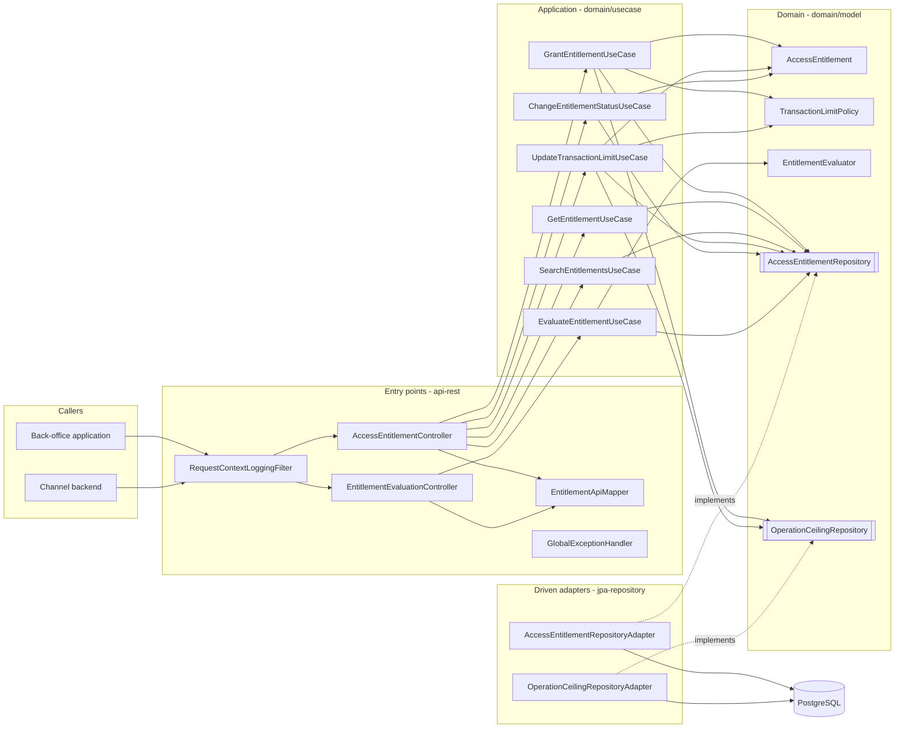
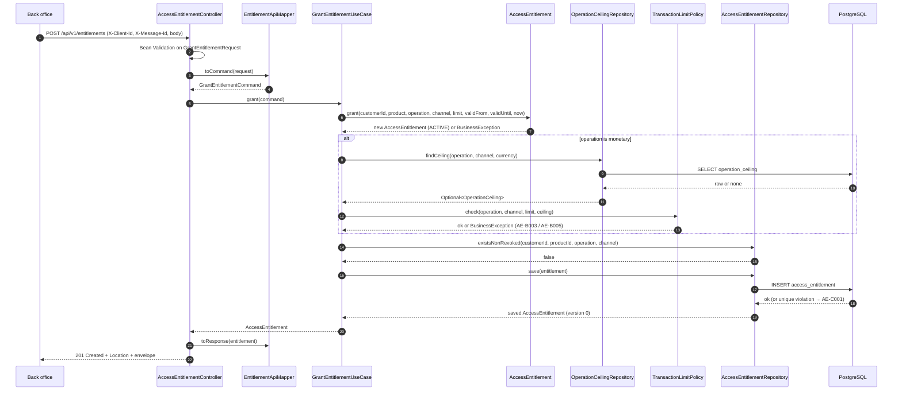
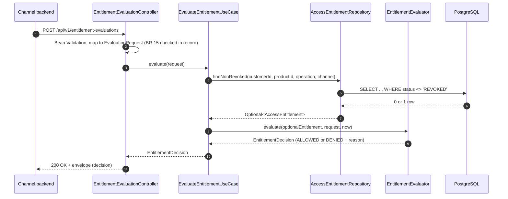
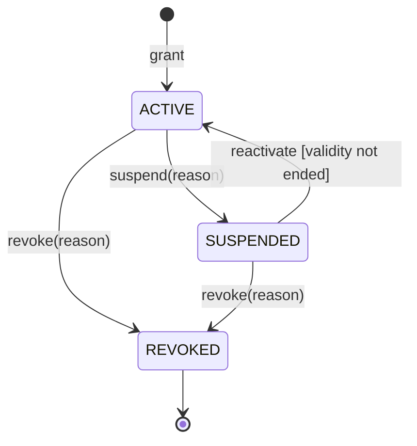
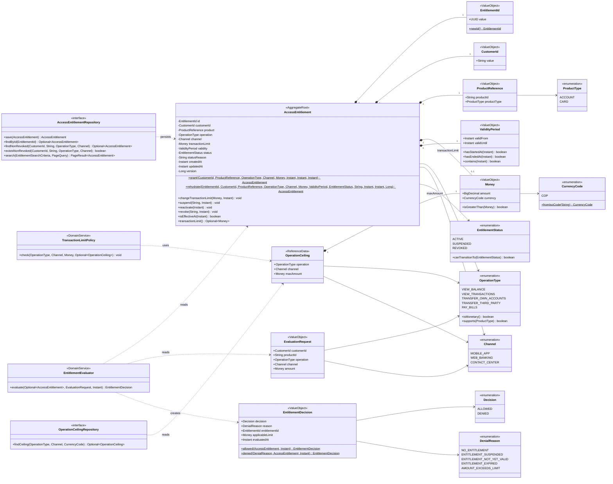
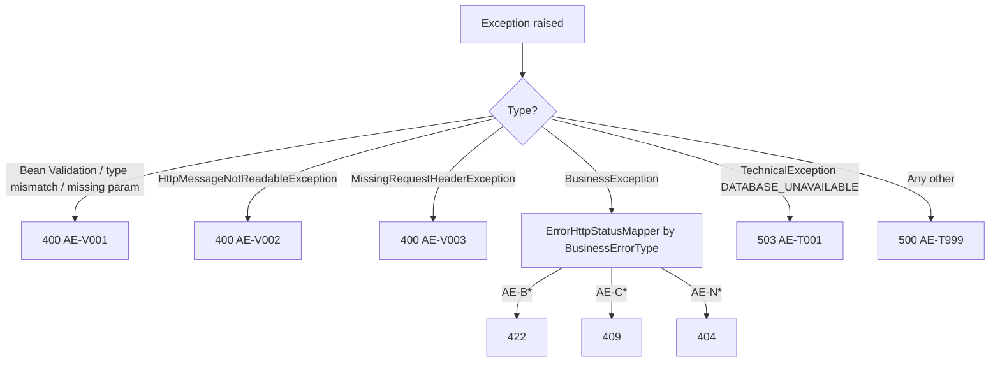

# Project 01 — Access Entitlements

> Portfolio project. All customers, products, limits, and ceilings are fictional. Version 1 has **no authentication** by design and must only run on a local or private network.

---

## 1. Project Overview

| Item | Value |
| ---- | ----- |
| Project name | Access Entitlements |
| Level | Junior |
| Programming model | Imperative — Spring MVC, blocking JDBC via JPA |
| Technical microservice | `ms-access-entitlements` |
| Root package | `co.fintech.entitlements` |
| Contract file | `contract/access-entitlements-api-v1.yaml` |

### Purpose

Build a REST microservice that is the single system of record for **what a customer is entitled to do**: which operation, on which of their products, through which digital channel, and up to which per-transaction amount. Channels call it in real time to decide whether to allow an operation.

The learning purpose is to establish solid Spring Boot fundamentals inside a strict Clean Architecture, with a domain that has real business rules instead of plain CRUD.

### Prerequisites

* Core Java: classes, interfaces, enums, collections, exceptions, generics (Head First Java level).
* HTTP and REST basics, reading and writing OpenAPI contracts.
* Git and GitHub.
* Docker installed locally.
* JDK 21 (Temurin recommended) installed and configured as the Gradle toolchain.

### New competencies

* Multi-module Gradle project generated with the open-source `scaffold-clean-architecture` Gradle plugin.
* Contract-first REST API design and implementation.
* Value objects, aggregate roots, invariants, domain services, and an explicit state machine.
* Separation of domain entity, API DTO, persistence entity, and response model.
* Bean Validation, custom constraint annotations, centralized exception handling.
* Spring Data JPA, Flyway migrations, optimistic locking, partial unique indexes.
* Unit tests, slice tests, Testcontainers integration tests, and architecture tests with ArchUnit.
* Spring Boot Actuator health checks, structured logging, and containerization.

### Technologies

| Technology | Use |
| ---------- | --- |
| Java 21 | Records, enums with behavior, `BigDecimal`, `Optional`, `java.time` |
| Spring Boot 4.1.x | Application framework |
| Spring Web MVC | REST entry points |
| Jakarta Bean Validation | Request validation |
| Spring Data JPA (Hibernate) | Persistence adapter |
| Flyway | Schema versioning and reference-data seeding |
| PostgreSQL 17 | Database |
| Spring Boot Actuator + Micrometer | Health and basic metrics |
| JUnit Jupiter, AssertJ, Mockito | Unit tests |
| Testcontainers | PostgreSQL integration tests |
| ArchUnit | Enforcing Clean Architecture rules as tests |
| Docker / Docker Compose | Container image and local environment |
| Gradle 9.x | Build |

### Technologies intentionally excluded

| Excluded | Why |
| -------- | --- |
| Spring Security, OAuth2, JWT | Introduced in Project 02. Keeping it out lets this project focus on layering and domain rules. The API contract states the gap explicitly. |
| WebFlux / Reactor | The workload is simple request–response over a single database; reactive adds cost without benefit (see Section 3). |
| Redis / caching | Evaluation reads one indexed row; there is no measured latency problem to solve. |
| Kafka / events | No consumer needs entitlement events yet. |
| Kubernetes | Introduced in Project 04. Docker Compose is enough here. |
| Lombok in domain and use cases | Records and plain Java make the domain explicit and framework-free. |
| MapStruct | Manual mappers make you understand every mapping decision. |
| OpenAPI code generation | DTOs are hand-written and verified against the contract with tests, so you learn what the contract implies. |
| Remote service calls | Introduced in Project 03 (WebClient) and Project 04 (RestClient). |

---

## 2. Business Context and Functional Scope

### Business problem

Digital channels (mobile app, web banking, contact center) each hard-code rules such as "third-party transfers up to 20 million COP on the app". Rules drift between channels, every change needs several releases, and nobody can answer "what exactly is this customer allowed to do?" from one place. The bank needs a central, auditable record of entitlements and a fast, deterministic evaluation operation.

### Business capability

Customer access entitlement management: grant, maintain, and evaluate a customer's rights to perform operations on their products through specific channels, within per-transaction limits.

### BIAN Service Domain mapping

```text
BIAN Service Domain   : Customer Access Entitlement
        ↓
Business Capability   : Manage and evaluate customer operation entitlements per product and channel
        ↓
Technical Microservice: ms-access-entitlements
        ↓
API                   : Access Entitlements API v1  (/api/v1)
        ↓
Use Cases             : Grant, Get, Search, Update Transaction Limit,
                        Suspend / Reactivate / Revoke, Evaluate
        ↓
Domain Model          : AccessEntitlement (aggregate root), OperationCeiling (reference data),
                        EntitlementEvaluator, TransactionLimitPolicy
```

The BIAN name is used for business mapping only; it is not forced into the technical service name.

### Actors

| Actor | Role |
| ----- | ---- |
| Back-office operations application | Grants entitlements, changes limits, suspends, reactivates, revokes |
| Digital channel backend (mobile/web BFF) | Evaluates whether a customer may perform an operation right now |
| Database administrator | Maintains operation ceilings through versioned migrations (no API in v1) |

### Use cases

| ID | Use case | Actor | Summary |
| -- | -------- | ----- | ------- |
| UC-01 | Grant entitlement | Back office | Create an entitlement for a customer, product, operation, and channel |
| UC-02 | Get entitlement | Back office | Retrieve one entitlement by id, including revoked ones |
| UC-03 | Search entitlements | Back office | List a customer's entitlements, optionally filtered by status, paginated |
| UC-04 | Update transaction limit | Back office | Change the per-transaction limit of an active monetary entitlement |
| UC-05 | Suspend entitlement | Back office | Temporarily block an entitlement with a reason |
| UC-06 | Reactivate entitlement | Back office | Lift a suspension |
| UC-07 | Revoke entitlement | Back office | Permanently end an entitlement with a reason |
| UC-08 | Evaluate entitlement | Channel backend | Decide ALLOWED or DENIED for a concrete operation request |

### Functional requirements

| ID | Requirement |
| -- | ----------- |
| FR-01 | The system shall create entitlements with customer, product reference, operation, channel, optional limit, and validity period. |
| FR-02 | The system shall return an entitlement by id. |
| FR-03 | The system shall list a customer's entitlements, filterable by status, with pagination (max 50 per page). |
| FR-04 | The system shall change the per-transaction limit of an active monetary entitlement. |
| FR-05 | The system shall suspend, reactivate, and revoke entitlements following the state machine. |
| FR-06 | The system shall evaluate a request and return ALLOWED or DENIED with a reason code. |
| FR-07 | Every response shall use the standard envelope with `meta.clientId`, `meta.timestamp`, and `meta.messageId`. |
| FR-08 | Every error shall be returned with a catalogued error code. |

### Business rules

| ID | Rule |
| -- | ---- |
| BR-01 | Monetary operations (`TRANSFER_OWN_ACCOUNTS`, `TRANSFER_THIRD_PARTY`, `PAY_BILLS`) require a per-transaction limit. |
| BR-02 | Non-monetary operations (`VIEW_BALANCE`, `VIEW_TRANSACTIONS`) must not carry a limit. |
| BR-03 | Amounts are strictly greater than zero, have at most 2 decimal places and at most 15 integer digits. |
| BR-04 | Only the `COP` currency is supported in v1. |
| BR-05 | A monetary operation is available on a channel only if an operation ceiling exists for that operation, channel, and currency. |
| BR-06 | A limit must not exceed the applicable operation ceiling. |
| BR-07 | Transfer operations apply only to `ACCOUNT` products; `PAY_BILLS` applies to `ACCOUNT` and `CARD`; view operations apply to both. |
| BR-08 | `validFrom` defaults to the current instant. If provided, it must not be earlier than the current instant minus 5 minutes (clock-skew tolerance). `validUntil` is optional; if provided it must be after `validFrom` and after the current instant. |
| BR-09 | At most one non-revoked entitlement may exist per (customer, product, operation, channel). |
| BR-10 | Allowed transitions: `ACTIVE → SUSPENDED`, `SUSPENDED → ACTIVE`, `ACTIVE → REVOKED`, `SUSPENDED → REVOKED`. `REVOKED` is terminal. A request to move to the current status is rejected. |
| BR-11 | Suspension and revocation require a reason of 5 to 200 characters. |
| BR-12 | Reactivation is rejected if the validity period has already ended. |
| BR-13 | The limit can only be changed while the entitlement is `ACTIVE`. The new limit is subject to BR-01 to BR-06. |
| BR-14 | Evaluation precedence (first match wins): no non-revoked entitlement → `NO_ENTITLEMENT`; suspended → `ENTITLEMENT_SUSPENDED`; before `validFrom` → `ENTITLEMENT_NOT_YET_VALID`; at or after `validUntil` → `ENTITLEMENT_EXPIRED`; monetary amount greater than limit → `AMOUNT_EXCEEDS_LIMIT`; otherwise `ALLOWED`. An amount equal to the limit is allowed. |
| BR-15 | Evaluating a monetary operation requires an amount; evaluating a non-monetary operation must not include one. |
| BR-16 | A denial is a valid business outcome returned with HTTP 200 and `decision = DENIED`; it is not an error. |
| BR-17 | Entitlements are never physically deleted. Revoked entitlements remain queryable. |
| BR-18 | Evaluation is stateless: it neither consumes nor accumulates limits. Cumulative daily limits are out of scope. |

### Non-functional requirements

| ID | Requirement |
| -- | ----------- |
| NFR-01 | Evaluation p95 latency below 100 ms at 50 requests/second on a developer machine (JMeter baseline). |
| NFR-02 | All monetary values handled with `BigDecimal`; never `double` or `float`. |
| NFR-03 | All timestamps stored and returned in UTC (ISO-8601 with `Z`). |
| NFR-04 | The domain and use case modules contain zero Spring, JPA, or Jackson imports (verified by ArchUnit). |
| NFR-05 | Line coverage of domain and use case modules at least 85%. |
| NFR-06 | The service starts with one `docker compose up` command. |
| NFR-07 | No customer identifier or product identifier is written unmasked to logs. |

### In scope

Everything listed under use cases UC-01 to UC-08, the operation-ceiling reference table (read-only, seeded by migration), health checks, structured logs, container image.

### Out of scope

Authentication and authorization; cumulative (daily/monthly) limits; multi-currency; entitlement events; decision logs; managing ceilings through the API; customer or product existence validation against other systems; delegation (acting on behalf of another party).

### Assumptions

* Callers are trusted internal applications on a private network (valid only for v1).
* Customer and product identifiers are internal references issued by other systems; this service does not validate that they exist.
* Product identifiers are never full account numbers or card numbers (PAN).
* Operation ceilings change rarely and are managed by migrations.

### Acceptance criteria

| ID | Given | When | Then |
| -- | ----- | ---- | ---- |
| AC-01 | No entitlement exists for the tuple | A valid monetary grant with a limit under the ceiling is sent | 201, `status = ACTIVE`, `Location` header points to the new resource |
| AC-02 | A non-revoked entitlement exists for the tuple | The same tuple is granted again | 409 with `AE-C001` |
| AC-03 | Ceiling for `TRANSFER_THIRD_PARTY` on `MOBILE_APP` is 20,000,000 COP | A grant requests 25,000,000 COP | 422 with `AE-B003` |
| AC-04 | No ceiling exists for `TRANSFER_THIRD_PARTY` on `CONTACT_CENTER` | A grant for that combination is sent | 422 with `AE-B005` |
| AC-05 | A grant for `VIEW_BALANCE` includes a limit | It is sent | 422 with `AE-B002` |
| AC-06 | An `ACTIVE` entitlement | It is suspended with a valid reason | 200, `status = SUSPENDED`, `statusReason` set |
| AC-07 | A `REVOKED` entitlement | Reactivation is requested | 409 with `AE-C002` |
| AC-08 | An `ACTIVE` entitlement with limit 5,000,000 COP | An evaluation for 5,000,000 COP | 200, `decision = ALLOWED` |
| AC-09 | The same entitlement | An evaluation for 5,000,000.01 COP | 200, `decision = DENIED`, `reasonCode = AMOUNT_EXCEEDS_LIMIT` |
| AC-10 | A `SUSPENDED` entitlement | An evaluation for an allowed amount | 200, `decision = DENIED`, `reasonCode = ENTITLEMENT_SUSPENDED` |
| AC-11 | Any request | `X-Message-Id` is missing | 400 with `AE-V003` |
| AC-12 | The database is stopped | Any request | 503 with `AE-T001`; the service process stays alive |

---

## 3. Architecture and Learning Objectives

### Learning objectives

By the end of this project you can:

1. Explain and enforce the dependency rule of Clean Architecture in a multi-module Gradle build.
2. Model a domain with an aggregate root, value objects, enums with behavior, and domain services.
3. Distinguish rules the aggregate enforces alone from rules that need external reference data.
4. Implement a REST API that matches a pre-written OpenAPI contract exactly.
5. Map between four different models (DTO, command/domain, JPA entity, response) and justify each mapping.
6. Translate technical failures into a stable error catalogue.
7. Use optimistic locking and database constraints to protect invariants under concurrency.
8. Test each layer with the right kind of test.

### Architecture

The service follows the conventions of the open-source `scaffold-clean-architecture` Gradle plugin:

| Scaffold module | Clean Architecture role | Contents in this project |
| --------------- | ----------------------- | ------------------------ |
| `domain/model` | Domain (entities, value objects, domain services, output ports) | `AccessEntitlement`, value objects, enums, `EntitlementEvaluator`, `TransactionLimitPolicy`, gateway interfaces |
| `domain/usecase` | Application (use cases = input ports) | Six use case classes and their commands |
| `infrastructure/entry-points/api-rest` | Entry points (driving adapters) | Controllers, DTOs, validation, exception handler, envelope |
| `infrastructure/driven-adapters/jpa-repository` | Driven adapters | JPA entities, Spring Data repositories, gateway implementations, Flyway migrations |
| `applications/app-service` | Composition root | Main class, bean wiring, configuration |

Scaffold commands (confirm the exact flags for your plugin version with `gradle help --task ca`):

```text
gradle ca --package=co.fintech.entitlements --type=imperative --name=ms-access-entitlements --lombok=false
gradle gm --name=AccessEntitlement
gradle gm --name=OperationCeiling
gradle guc --name=GrantEntitlement
gradle guc --name=GetEntitlement
gradle guc --name=SearchEntitlements
gradle guc --name=UpdateTransactionLimit
gradle guc --name=ChangeEntitlementStatus
gradle guc --name=EvaluateEntitlement
gradle gda --type=jpa
gradle gep --type=restmvc
```

After generation, set the Java toolchain to 21 in the root build configuration and upgrade the Spring Boot version to 4.1.x if the plugin generated an older one.

### Clean Architecture and dependency direction

```text
applications/app-service   (knows everything, wires everything)
        │
        ├──► infrastructure/entry-points/api-rest ──┐
        │                                           ▼
        ├──► infrastructure/driven-adapters/jpa ──► domain/usecase ──► domain/model
        │                   │                                           ▲
        │                   └──────── implements gateways ──────────────┘
```

* `domain/model` depends on nothing but the JDK.
* `domain/usecase` depends only on `domain/model`.
* Entry points call use cases. Driven adapters implement gateway interfaces declared in `domain/model`.
* Only `app-service` knows Spring configuration for all modules.

### Input ports

In the scaffold convention, each use case class **is** the input port: entry points depend on the use case's public methods. No separate input-port interface is declared in this project (see Architecture Decisions in Section 11 — you must be able to defend this).

| Input port (use case) | Public methods |
| --------------------- | -------------- |
| `GrantEntitlementUseCase` | `grant(GrantEntitlementCommand)` |
| `GetEntitlementUseCase` | `getById(EntitlementId)` |
| `SearchEntitlementsUseCase` | `search(EntitlementSearchCriteria, PageQuery)` |
| `UpdateTransactionLimitUseCase` | `updateLimit(EntitlementId, Money)` |
| `ChangeEntitlementStatusUseCase` | `suspend(EntitlementId, String)`, `reactivate(EntitlementId)`, `revoke(EntitlementId, String)` |
| `EvaluateEntitlementUseCase` | `evaluate(EvaluationRequest)` |

### Output ports (gateways)

| Output port | Declared in | Implemented by |
| ----------- | ----------- | -------------- |
| `AccessEntitlementRepository` | `model.accessentitlement.gateways` | `AccessEntitlementRepositoryAdapter` (JPA) |
| `OperationCeilingRepository` | `model.operationceiling.gateways` | `OperationCeilingRepositoryAdapter` (JPA) |

`java.time.Clock` is injected into use cases as a JDK type (not a port) so time-dependent rules are testable.

### Entry points

| Entry point | Base path |
| ----------- | --------- |
| `AccessEntitlementController` | `/api/v1/entitlements` |
| `EntitlementEvaluationController` | `/api/v1/entitlement-evaluations` |
| `GlobalExceptionHandler` | All controllers |
| `RequestContextLoggingFilter` | All requests |

### Driven adapters

| Adapter | Technology | External system |
| ------- | ---------- | --------------- |
| `AccessEntitlementRepositoryAdapter` | Spring Data JPA | PostgreSQL table `access_entitlement` |
| `OperationCeilingRepositoryAdapter` | Spring Data JPA | PostgreSQL table `operation_ceiling` |

### Package structure

```text
ms-access-entitlements/
├── contract/
│   └── access-entitlements-api-v1.yaml
├── applications/
│   └── app-service/src/main/java/co/fintech/entitlements/
│       ├── MainApplication.java
│       └── config/
│           ├── UseCasesConfig.java
│           └── DomainConfig.java
├── domain/
│   ├── model/src/main/java/co/fintech/entitlements/model/
│   │   ├── accessentitlement/
│   │   │   ├── AccessEntitlement.java
│   │   │   ├── EntitlementId.java
│   │   │   ├── CustomerId.java
│   │   │   ├── ProductReference.java
│   │   │   ├── ProductType.java
│   │   │   ├── OperationType.java
│   │   │   ├── Channel.java
│   │   │   ├── EntitlementStatus.java
│   │   │   ├── ValidityPeriod.java
│   │   │   ├── EntitlementSearchCriteria.java
│   │   │   ├── TransactionLimitPolicy.java
│   │   │   └── gateways/AccessEntitlementRepository.java
│   │   ├── operationceiling/
│   │   │   ├── OperationCeiling.java
│   │   │   └── gateways/OperationCeilingRepository.java
│   │   ├── evaluation/
│   │   │   ├── EvaluationRequest.java
│   │   │   ├── EntitlementDecision.java
│   │   │   ├── Decision.java
│   │   │   ├── DenialReason.java
│   │   │   └── EntitlementEvaluator.java
│   │   ├── shared/
│   │   │   ├── Money.java
│   │   │   ├── CurrencyCode.java
│   │   │   ├── PageQuery.java
│   │   │   └── PageResult.java
│   │   └── exception/
│   │       ├── BusinessException.java
│   │       ├── BusinessErrorType.java
│   │       ├── TechnicalException.java
│   │       └── TechnicalErrorType.java
│   └── usecase/src/main/java/co/fintech/entitlements/usecase/
│       ├── grantentitlement/
│       │   ├── GrantEntitlementUseCase.java
│       │   └── GrantEntitlementCommand.java
│       ├── getentitlement/GetEntitlementUseCase.java
│       ├── searchentitlements/SearchEntitlementsUseCase.java
│       ├── updatetransactionlimit/UpdateTransactionLimitUseCase.java
│       ├── changeentitlementstatus/ChangeEntitlementStatusUseCase.java
│       └── evaluateentitlement/EvaluateEntitlementUseCase.java
├── infrastructure/
│   ├── entry-points/api-rest/src/main/java/co/fintech/entitlements/api/
│   │   ├── entitlement/AccessEntitlementController.java
│   │   ├── evaluation/EntitlementEvaluationController.java
│   │   ├── dto/request/
│   │   │   ├── GrantEntitlementRequest.java
│   │   │   ├── ProductReferenceDto.java
│   │   │   ├── MoneyDto.java
│   │   │   ├── UpdateTransactionLimitRequest.java
│   │   │   ├── StatusChangeRequest.java
│   │   │   └── EvaluateEntitlementRequest.java
│   │   ├── dto/response/
│   │   │   ├── EntitlementResponse.java
│   │   │   ├── ValidityDto.java
│   │   │   ├── EntitlementPageResponse.java
│   │   │   ├── PageInfoDto.java
│   │   │   └── EntitlementDecisionResponse.java
│   │   ├── common/
│   │   │   ├── ApiResponse.java
│   │   │   ├── ApiData.java
│   │   │   ├── ResponseMeta.java
│   │   │   ├── ErrorResponse.java
│   │   │   ├── ErrorBody.java
│   │   │   ├── ErrorDetail.java
│   │   │   └── ApiResponseFactory.java
│   │   ├── mapper/EntitlementApiMapper.java
│   │   ├── error/
│   │   │   ├── GlobalExceptionHandler.java
│   │   │   └── ErrorHttpStatusMapper.java
│   │   ├── validation/
│   │   │   ├── ValueOfEnum.java
│   │   │   └── ValueOfEnumValidator.java
│   │   └── logging/RequestContextLoggingFilter.java
│   └── driven-adapters/jpa-repository/src/main/
│       ├── java/co/fintech/entitlements/jpa/
│       │   ├── entity/
│       │   │   ├── AccessEntitlementEntity.java
│       │   │   ├── OperationCeilingEntity.java
│       │   │   └── OperationCeilingKey.java
│       │   ├── repository/
│       │   │   ├── AccessEntitlementJpaRepository.java
│       │   │   └── OperationCeilingJpaRepository.java
│       │   ├── mapper/AccessEntitlementEntityMapper.java
│       │   └── adapter/
│       │       ├── AccessEntitlementRepositoryAdapter.java
│       │       └── OperationCeilingRepositoryAdapter.java
│       └── resources/db/migration/
│           ├── V1__create_access_entitlement.sql
│           ├── V2__create_operation_ceiling.sql
│           └── V3__seed_operation_ceiling.sql
├── deployment/Dockerfile
└── docker-compose.yaml
```

### Architecture trade-offs

| Decision | Chosen | Alternative | Trade-off |
| -------- | ------ | ----------- | --------- |
| Input ports | Concrete use case classes (scaffold convention) | Interface per use case | Less ceremony and one less file per use case; weaker if you ever need several implementations of one use case. |
| Transaction boundary | Inside the driven adapter (one aggregate written per use case) | `TransactionTemplate` around use cases | Keeps use cases framework-free; correct only because each use case writes a single aggregate once. Must change if a use case ever writes two aggregates. |
| Ceiling enforcement | `TransactionLimitPolicy` domain service called by use cases | Aggregate receives ceiling | Rules that need external reference data live in a domain service; the aggregate still enforces everything it can know alone. |
| Duplicate prevention | Use case pre-check + database partial unique index | Pre-check only | The pre-check gives a fast, clear error; the index is the real guarantee under concurrent requests. |
| Denial as HTTP 200 | 200 with `decision = DENIED` | 403 or 422 | The request was processed correctly; the answer is simply "no". Using 4xx would make monitoring treat normal denials as failures. |
| State changes | Action sub-resources (`/suspend`, `/reactivate`, `/revoke`) | `PATCH` on `status` field | Each action has different rules and bodies; explicit endpoints map one-to-one to use case methods. Less "pure REST". |
| Money in JSON | Decimal as string | JSON number | Avoids binary floating-point conversion in clients. Clients must parse strings. |

### Architecture diagram



### Sequence diagram — Grant entitlement



### Sequence diagram — Evaluate entitlement



### Reactive architecture analysis

Not applicable as an implementation choice — this project is imperative on purpose. The reasoning you must be able to repeat:

* Each request performs one or two short, indexed database queries and no remote calls. There is no fan-out and almost no waiting to overlap.
* Blocking JDBC with a thread-per-request model (or virtual threads) comfortably serves the target load.
* Imperative code is easier to debug and test while you are learning layering and domain modeling.
* Reactive would only pay off here if evaluation had to call several remote systems concurrently under a tight latency budget — exactly the situation you will meet in Project 03.

---

## 4. Detailed Domain Model

### Aggregates and aggregate roots

| Aggregate | Root | Contains | Boundary rule |
| --------- | ---- | -------- | ------------- |
| Access entitlement | `AccessEntitlement` | Value objects `EntitlementId`, `CustomerId`, `ProductReference`, `Money`, `ValidityPeriod` | All changes to one entitlement go through the root. One transaction writes one aggregate. |
| Operation ceiling | `OperationCeiling` | `Money` | Read-only reference data in v1; referenced by value (operation, channel, currency), never by object reference. |

Customer and product are **external concepts** referenced by identifier only; this service does not own them.

### Entities

#### AccessEntitlement

| Attribute | Java Type | Required | Description | Validation |
| --------- | --------- | -------- | ----------- | ---------- |
| `id` | `EntitlementId` | Yes | Unique identifier | Generated at grant time (UUID) |
| `customerId` | `CustomerId` | Yes | Owner of the entitlement | Non-null |
| `product` | `ProductReference` | Yes | Product the entitlement applies to | Non-null; BR-07 compatibility with operation |
| `operation` | `OperationType` | Yes | Permitted operation | Non-null |
| `channel` | `Channel` | Yes | Channel through which the operation is permitted | Non-null |
| `transactionLimit` | `Money` | Conditional | Maximum amount per transaction | Required for monetary operations (BR-01), forbidden otherwise (BR-02) |
| `validity` | `ValidityPeriod` | Yes | When the entitlement is effective | BR-08 |
| `status` | `EntitlementStatus` | Yes | Lifecycle status | Transitions per BR-10 |
| `statusReason` | `String` | Conditional | Reason for last suspension or revocation | 5–200 chars when set; cleared on reactivation |
| `createdAt` | `Instant` | Yes | Creation instant (UTC) | Set once at grant |
| `updatedAt` | `Instant` | Yes | Last modification instant | Updated on every state or limit change |
| `version` | `Long` | No | Optimistic-locking version | `null` for a new aggregate, assigned by persistence |

### Value objects

#### EntitlementId

| Attribute | Java Type | Required | Description | Validation |
| --------- | --------- | -------- | ----------- | ---------- |
| `value` | `UUID` | Yes | Identifier value | Non-null |

#### CustomerId

| Attribute | Java Type | Required | Description | Validation |
| --------- | --------- | -------- | ----------- | ---------- |
| `value` | `String` | Yes | Internal customer reference | Non-blank; format `^[A-Z0-9]{8,20}$` validated at the API edge |

#### ProductReference

| Attribute | Java Type | Required | Description | Validation |
| --------- | --------- | -------- | ----------- | ---------- |
| `productId` | `String` | Yes | Internal product reference, never a full account number or PAN | Non-blank; `^[A-Z0-9-]{6,30}$` at API edge |
| `productType` | `ProductType` | Yes | Kind of product | Non-null |

#### Money

| Attribute | Java Type | Required | Description | Validation |
| --------- | --------- | -------- | ----------- | ---------- |
| `amount` | `BigDecimal` | Yes | Monetary amount | `> 0`, scale ≤ 2, integer digits ≤ 15 (BR-03) → `AE-B008` |
| `currency` | `CurrencyCode` | Yes | Currency | Non-null |

#### ValidityPeriod

| Attribute | Java Type | Required | Description | Validation |
| --------- | --------- | -------- | ----------- | ---------- |
| `validFrom` | `Instant` | Yes | Start of validity (inclusive) | Non-null |
| `validUntil` | `Instant` | No | End of validity (exclusive); `null` = open-ended | If present, strictly after `validFrom` → `AE-B004` |

#### OperationCeiling

| Attribute | Java Type | Required | Description | Validation |
| --------- | --------- | -------- | ----------- | ---------- |
| `operation` | `OperationType` | Yes | Monetary operation | Must be monetary |
| `channel` | `Channel` | Yes | Channel | Non-null |
| `maxAmount` | `Money` | Yes | Maximum limit allowed for this combination | Positive |

#### EvaluationRequest

| Attribute | Java Type | Required | Description | Validation |
| --------- | --------- | -------- | ----------- | ---------- |
| `customerId` | `CustomerId` | Yes | Customer attempting the operation | Non-null |
| `productId` | `String` | Yes | Product reference | Non-blank |
| `operation` | `OperationType` | Yes | Operation attempted | Non-null |
| `channel` | `Channel` | Yes | Channel used | Non-null |
| `amount` | `Money` | Conditional | Amount of the attempted transaction | BR-15 → `AE-B001` / `AE-B002` |

#### EntitlementDecision

| Attribute | Java Type | Required | Description | Validation |
| --------- | --------- | -------- | ----------- | ---------- |
| `decision` | `Decision` | Yes | ALLOWED or DENIED | Non-null |
| `reason` | `DenialReason` | Conditional | Why the request was denied | Present if and only if DENIED |
| `entitlementId` | `EntitlementId` | No | Entitlement used for the decision | `null` when `NO_ENTITLEMENT` |
| `applicableLimit` | `Money` | No | Limit applied, for monetary operations | `null` for non-monetary or no entitlement |
| `evaluatedAt` | `Instant` | Yes | Evaluation instant | Non-null |

#### EntitlementSearchCriteria, PageQuery, PageResult

| Type | Attribute | Java Type | Required | Validation |
| ---- | --------- | --------- | -------- | ---------- |
| `EntitlementSearchCriteria` | `customerId` | `CustomerId` | Yes | Non-null |
| `EntitlementSearchCriteria` | `status` | `EntitlementStatus` | No | `null` = all statuses |
| `PageQuery` | `page` | `int` | Yes | `>= 0` |
| `PageQuery` | `size` | `int` | Yes | `1..50` |
| `PageResult<T>` | `items` | `List<T>` | Yes | Unmodifiable |
| `PageResult<T>` | `page` | `int` | Yes | `>= 0` |
| `PageResult<T>` | `size` | `int` | Yes | `1..50` |
| `PageResult<T>` | `totalItems` | `long` | Yes | `>= 0` |
| `PageResult<T>` | `totalPages` | `int` | Yes | `>= 0` |

`PageQuery` and `PageResult` exist because the domain must not depend on Spring Data's `Pageable` and `Page`.

### Enums

| Enum | Values | Behavior |
| ---- | ------ | -------- |
| `OperationType` | `VIEW_BALANCE`, `VIEW_TRANSACTIONS`, `TRANSFER_OWN_ACCOUNTS`, `TRANSFER_THIRD_PARTY`, `PAY_BILLS` | `isMonetary()`; `supports(ProductType)` implementing BR-07 |
| `Channel` | `MOBILE_APP`, `WEB_BANKING`, `CONTACT_CENTER` | None |
| `ProductType` | `ACCOUNT`, `CARD` | None |
| `EntitlementStatus` | `ACTIVE`, `SUSPENDED`, `REVOKED` | `canTransitionTo(EntitlementStatus)` implementing BR-10 |
| `CurrencyCode` | `COP` | `fromIsoCode(String)` throws `AE-B006` for unsupported codes |
| `Decision` | `ALLOWED`, `DENIED` | None |
| `DenialReason` | `NO_ENTITLEMENT`, `ENTITLEMENT_SUSPENDED`, `ENTITLEMENT_NOT_YET_VALID`, `ENTITLEMENT_EXPIRED`, `AMOUNT_EXCEEDS_LIMIT` | None |

Operation/product compatibility (BR-07):

| Operation | ACCOUNT | CARD | Monetary |
| --------- | :-----: | :--: | :------: |
| `VIEW_BALANCE` | Yes | Yes | No |
| `VIEW_TRANSACTIONS` | Yes | Yes | No |
| `TRANSFER_OWN_ACCOUNTS` | Yes | No | Yes |
| `TRANSFER_THIRD_PARTY` | Yes | No | Yes |
| `PAY_BILLS` | Yes | Yes | Yes |

### Domain services

| Service | Responsibility | Why it is not inside the aggregate |
| ------- | -------------- | ---------------------------------- |
| `TransactionLimitPolicy` | Enforces BR-05 and BR-06 using an operation ceiling | Needs reference data the aggregate does not own |
| `EntitlementEvaluator` | Applies the BR-14 precedence to produce a decision | The decision involves the request and the possible absence of an entitlement; it is a stateless calculation, not a state change |

### Domain events

Not implemented in v1. The natural events would be `EntitlementGranted`, `EntitlementLimitChanged`, `EntitlementSuspended`, `EntitlementReactivated`, and `EntitlementRevoked`. They become necessary when another service must react to entitlement changes (for example a cache in another service). Introducing them without a consumer would be speculative design.

### Relationships and cardinality

| From | To | Cardinality | Nature |
| ---- | -- | ----------- | ------ |
| Customer (external) | `AccessEntitlement` | 1 → 0..* | Referenced by `CustomerId` |
| Product (external) | `AccessEntitlement` | 1 → 0..* | Referenced by `ProductReference.productId` |
| (customer, product, operation, channel) | Non-revoked `AccessEntitlement` | 1 → 0..1 | BR-09 |
| `OperationCeiling` | `AccessEntitlement` | 1 → 0..* | Policy reference by value; no foreign key |
| `AccessEntitlement` | `Money` (limit) | 1 → 0..1 | Composition |
| `AccessEntitlement` | `ValidityPeriod` | 1 → 1 | Composition |

### State transitions



"Expired" is not a stored status. It is derived at evaluation time from `validity` and the current instant. Storing it would require a scheduler to keep it accurate.

### Business invariants

| ID | Invariant | Enforced by |
| -- | --------- | ----------- |
| INV-01 | A monetary entitlement always has a limit; a non-monetary one never does | `AccessEntitlement.grant`, `changeTransactionLimit` |
| INV-02 | Money is always positive with scale ≤ 2 | `Money` compact constructor |
| INV-03 | `validUntil`, when present, is after `validFrom` | `ValidityPeriod` compact constructor |
| INV-04 | Operation is compatible with product type | `AccessEntitlement.grant` via `OperationType.supports` |
| INV-05 | Status only changes through allowed transitions | `EntitlementStatus.canTransitionTo` used by aggregate methods |
| INV-06 | A revoked entitlement never changes again | Aggregate methods |
| INV-07 | At most one non-revoked entitlement per tuple | Use case pre-check + partial unique index |
| INV-08 | A limit never exceeds its ceiling | `TransactionLimitPolicy` |

### Validation rules by layer

| Layer | Validates | Examples |
| ----- | --------- | -------- |
| API (Bean Validation) | Syntax and shape | Required fields, patterns, lengths, enum names, header format |
| API mapper | Semantic conversion | Currency code supported (`AE-B006`) |
| Value objects | Self-consistency | Money positive, validity order |
| Aggregate | Rules about itself | BR-01, BR-02, BR-07, BR-08, BR-10–BR-13 |
| Domain service | Rules needing reference data | BR-05, BR-06 |
| Use case | Rules needing other aggregates | BR-09 pre-check |
| Database | Last line of defense | Partial unique index, check constraints |

### Domain class diagram



---

## 5. Detailed Class and Package Specification

Method signatures only. You write every implementation.

### 5.1 Domain model — `domain/model`

```text
Class: AccessEntitlement
Package: co.fintech.entitlements.model.accessentitlement
Layer: Domain (aggregate root)

Responsibility:
  Owns the lifecycle and invariants of one entitlement.

Attributes:
- id               EntitlementId      private final   identity
- customerId       CustomerId         private final   owner
- product          ProductReference   private final   target product
- operation        OperationType      private final   permitted operation
- channel          Channel            private final   permitted channel
- transactionLimit Money              private         per-transaction limit (nullable)
- validity         ValidityPeriod     private final   effective period
- status           EntitlementStatus  private         lifecycle status
- statusReason     String             private         reason of last suspension/revocation (nullable)
- createdAt        Instant            private final   creation instant
- updatedAt        Instant            private         last change instant
- version          Long               private final   optimistic-lock version (nullable when new)

Relationships:
  Composes EntitlementId, CustomerId, ProductReference, Money, ValidityPeriod.

Methods:
- private AccessEntitlement(all attributes)
    Private constructor; only factories create instances.
- public static AccessEntitlement grant(CustomerId customerId, ProductReference product,
      OperationType operation, Channel channel, Money transactionLimit,
      Instant requestedValidFrom, Instant requestedValidUntil, Instant now)
    Creates a new ACTIVE entitlement with a new id, createdAt = updatedAt = now, version = null.
    Rules: BR-01, BR-02 (AE-B001/AE-B002), BR-07 (AE-B007), BR-08 (AE-B004).
    requestedValidFrom null → now.
- public static AccessEntitlement rehydrate(EntitlementId id, CustomerId customerId,
      ProductReference product, OperationType operation, Channel channel, Money transactionLimit,
      ValidityPeriod validity, EntitlementStatus status, String statusReason,
      Instant createdAt, Instant updatedAt, Long version)
    Rebuilds an existing aggregate from persistence WITHOUT re-applying creation rules
    (a stored entitlement whose validFrom is in the past is still valid data).
- public void changeTransactionLimit(Money newLimit, Instant now)
    Rules: must be ACTIVE (AE-C004); operation must be monetary (AE-B002); newLimit non-null (AE-B001).
    Ceiling is checked by TransactionLimitPolicy before this call.
- public void suspend(String reason, Instant now)
    Rules: BR-10 (AE-C002), BR-11. Sets statusReason.
- public void reactivate(Instant now)
    Rules: BR-10 (AE-C002), BR-12 (AE-C002 with detail "validity period has ended"). Clears statusReason.
- public void revoke(String reason, Instant now)
    Rules: BR-10 (AE-C002), BR-11.
- public boolean isEffectiveAt(Instant instant)
    True when status is ACTIVE and validity contains the instant.
- public Optional<Money> transactionLimit()
- public EntitlementId id(), CustomerId customerId(), ProductReference product(),
  OperationType operation(), Channel channel(), ValidityPeriod validity(),
  EntitlementStatus status(), Optional<String> statusReason(), Instant createdAt(),
  Instant updatedAt(), Long version()

Dependencies:
  JDK only; BusinessException, BusinessErrorType.
```

```text
Class: EntitlementId (record)
Package: co.fintech.entitlements.model.accessentitlement
Layer: Domain (value object)
Responsibility: Typed identifier; prevents mixing ids of different concepts.
Attributes:
- value  UUID  public (record component)  identifier
Methods:
- compact constructor: requires non-null value (NullPointerException otherwise)
- public static EntitlementId newId()
- public static EntitlementId of(UUID value)
Dependencies: JDK only.
```

```text
Class: CustomerId (record)
Package: co.fintech.entitlements.model.accessentitlement
Layer: Domain (value object)
Responsibility: Typed customer reference.
Attributes:
- value  String  record component  customer reference
Methods:
- compact constructor: requires non-null, non-blank value (IllegalArgumentException otherwise)
- public String masked()  returns "****" + last 4 characters, for logging
Dependencies: JDK only.
```

```text
Class: ProductReference (record)
Package: co.fintech.entitlements.model.accessentitlement
Layer: Domain (value object)
Responsibility: Reference to an externally owned product.
Attributes:
- productId    String       record component
- productType  ProductType  record component
Methods:
- compact constructor: non-blank productId, non-null productType
- public String maskedProductId()  last 4 characters only, for logging
Dependencies: ProductType.
```

```text
Class: OperationType (enum)
Package: co.fintech.entitlements.model.accessentitlement
Layer: Domain
Responsibility: Catalogue of operations and their intrinsic rules.
Attributes:
- monetary               boolean           private final
- supportedProductTypes  Set<ProductType>  private final (unmodifiable)
Methods:
- public boolean isMonetary()
- public boolean supports(ProductType productType)   BR-07
Dependencies: ProductType.
```

```text
Class: EntitlementStatus (enum)
Package: co.fintech.entitlements.model.accessentitlement
Layer: Domain
Responsibility: Lifecycle states and allowed transitions.
Methods:
- public boolean canTransitionTo(EntitlementStatus target)   BR-10; returns false for same-state targets
Dependencies: none.
```

```text
Class: ValidityPeriod (record)
Package: co.fintech.entitlements.model.accessentitlement
Layer: Domain (value object)
Responsibility: Half-open time interval [validFrom, validUntil).
Attributes:
- validFrom   Instant  record component
- validUntil  Instant  record component (nullable = open-ended)
Methods:
- compact constructor: validFrom non-null; if validUntil present, validUntil.isAfter(validFrom) else AE-B004
- public boolean hasStartedAt(Instant instant)
- public boolean hasEndedAt(Instant instant)      false when open-ended; true when instant >= validUntil
- public boolean contains(Instant instant)
- public Optional<Instant> validUntilOptional()
Dependencies: BusinessException.
```

```text
Class: EntitlementSearchCriteria (record)
Package: co.fintech.entitlements.model.accessentitlement
Layer: Domain
Attributes:
- customerId  CustomerId         record component (required)
- status      EntitlementStatus  record component (nullable)
Methods:
- compact constructor: customerId non-null
- public Optional<EntitlementStatus> statusFilter()
```

```text
Class: TransactionLimitPolicy
Package: co.fintech.entitlements.model.accessentitlement
Layer: Domain (domain service, stateless)
Responsibility: Enforce BR-05 and BR-06.
Methods:
- public void check(OperationType operation, Channel channel, Money limit,
      Optional<OperationCeiling> ceiling)
    ceiling empty → AE-B005 OPERATION_NOT_AVAILABLE_ON_CHANNEL
    limit greater than ceiling.maxAmount → AE-B003 LIMIT_EXCEEDS_CEILING
    Must only be called for monetary operations (IllegalArgumentException otherwise).
Dependencies: OperationCeiling, Money, BusinessException.
```

```text
Interface: AccessEntitlementRepository
Package: co.fintech.entitlements.model.accessentitlement.gateways
Layer: Domain (output port)
Methods:
- AccessEntitlement save(AccessEntitlement entitlement)
    Returns the saved aggregate with its new version.
    Throws BusinessException AE-C001 on unique violation, AE-C003 on optimistic-lock conflict,
    TechnicalException AE-T001 when the database is unreachable.
- Optional<AccessEntitlement> findById(EntitlementId id)
- Optional<AccessEntitlement> findNonRevoked(CustomerId customerId, String productId,
      OperationType operation, Channel channel)
- boolean existsNonRevoked(CustomerId customerId, String productId,
      OperationType operation, Channel channel)
- PageResult<AccessEntitlement> search(EntitlementSearchCriteria criteria, PageQuery pageQuery)
    Ordered by createdAt descending.
```

```text
Class: OperationCeiling (record)
Package: co.fintech.entitlements.model.operationceiling
Layer: Domain (reference data)
Attributes:
- operation  OperationType  record component
- channel    Channel        record component
- maxAmount  Money          record component
Methods:
- compact constructor: all non-null; operation.isMonetary() must be true
Dependencies: OperationType, Channel, Money.
```

```text
Interface: OperationCeilingRepository
Package: co.fintech.entitlements.model.operationceiling.gateways
Layer: Domain (output port)
Methods:
- Optional<OperationCeiling> findCeiling(OperationType operation, Channel channel, CurrencyCode currency)
```

```text
Class: EvaluationRequest (record)
Package: co.fintech.entitlements.model.evaluation
Layer: Domain (value object)
Attributes: customerId CustomerId, productId String, operation OperationType, channel Channel, amount Money (nullable)
Methods:
- compact constructor: non-null customerId, operation, channel; non-blank productId;
    monetary operation without amount → AE-B001; non-monetary with amount → AE-B002 (BR-15)
- public Optional<Money> amountOptional()
```

```text
Class: EntitlementDecision (record)
Package: co.fintech.entitlements.model.evaluation
Layer: Domain (value object)
Attributes: decision Decision, reason DenialReason, entitlementId EntitlementId,
            applicableLimit Money, evaluatedAt Instant
Methods:
- compact constructor: reason present if and only if decision == DENIED
- public static EntitlementDecision allowed(AccessEntitlement entitlement, Instant evaluatedAt)
- public static EntitlementDecision denied(DenialReason reason, AccessEntitlement entitlementOrNull,
      Instant evaluatedAt)
```

```text
Class: EntitlementEvaluator
Package: co.fintech.entitlements.model.evaluation
Layer: Domain (domain service, stateless)
Responsibility: Apply BR-14 precedence deterministically.
Methods:
- public EntitlementDecision evaluate(Optional<AccessEntitlement> entitlement,
      EvaluationRequest request, Instant now)
    Precedence: NO_ENTITLEMENT → ENTITLEMENT_SUSPENDED → ENTITLEMENT_NOT_YET_VALID →
    ENTITLEMENT_EXPIRED → AMOUNT_EXCEEDS_LIMIT → ALLOWED.
    Receives only non-revoked entitlements; a REVOKED input is a programming error (IllegalStateException).
Dependencies: AccessEntitlement, EvaluationRequest, EntitlementDecision, DenialReason.
```

```text
Class: Money (record)
Package: co.fintech.entitlements.model.shared
Layer: Domain (value object)
Attributes: amount BigDecimal, currency CurrencyCode
Methods:
- compact constructor: non-null; amount > 0, scale <= 2, integer digits <= 15 → AE-B008
- public static Money of(BigDecimal amount, CurrencyCode currency)
- public boolean isGreaterThan(Money other)   same currency required (IllegalArgumentException otherwise);
      compares with compareTo, never equals
Note: decide and document how equals() behaves for 10.0 vs 10.00 (see Research).
```

```text
Class: CurrencyCode (enum)
Package: co.fintech.entitlements.model.shared
Values: COP
Methods:
- public static CurrencyCode fromIsoCode(String isoCode)   unsupported → AE-B006
```

```text
Class: PageQuery (record)
Package: co.fintech.entitlements.model.shared
Attributes: page int, size int
Methods: compact constructor: page >= 0, 1 <= size <= 50 (IllegalArgumentException)
```

```text
Class: PageResult<T> (record)
Package: co.fintech.entitlements.model.shared
Attributes: items List<T>, page int, size int, totalItems long, totalPages int
Methods:
- compact constructor: defensive copy of items with List.copyOf
- public <R> PageResult<R> map(Function<T, R> mapper)
```

```text
Class: BusinessException
Package: co.fintech.entitlements.model.exception
Layer: Domain
Extends: RuntimeException
Attributes:
- type    BusinessErrorType  private final
- detail  String             private final (human-readable, safe to return to callers)
- field   String             private final (nullable; request field the error refers to)
Methods:
- public BusinessException(BusinessErrorType type)
- public BusinessException(BusinessErrorType type, String detail)
- public BusinessException(BusinessErrorType type, String detail, String field)
- public BusinessErrorType getType(), String getDetail(), Optional<String> getField()
```

```text
Class: BusinessErrorType (enum)
Package: co.fintech.entitlements.model.exception
Attributes: code String, title String
Values:
  MONETARY_VALUE_REQUIRED("AE-B001", "Monetary value required")
  MONETARY_VALUE_NOT_ALLOWED("AE-B002", "Monetary value not allowed")
  LIMIT_EXCEEDS_CEILING("AE-B003", "Limit exceeds operation ceiling")
  INVALID_VALIDITY_PERIOD("AE-B004", "Invalid validity period")
  OPERATION_NOT_AVAILABLE_ON_CHANNEL("AE-B005", "Operation not available on channel")
  UNSUPPORTED_CURRENCY("AE-B006", "Unsupported currency")
  OPERATION_NOT_SUPPORTED_FOR_PRODUCT("AE-B007", "Operation not supported for product type")
  INVALID_AMOUNT("AE-B008", "Invalid amount")
  DUPLICATE_ENTITLEMENT("AE-C001", "Duplicate entitlement")
  INVALID_STATUS_TRANSITION("AE-C002", "Invalid status transition")
  CONCURRENT_MODIFICATION("AE-C003", "Concurrent modification")
  ENTITLEMENT_NOT_ACTIVE("AE-C004", "Entitlement not active")
  ENTITLEMENT_NOT_FOUND("AE-N001", "Entitlement not found")
Note: contains NO HTTP status; HTTP mapping belongs to the entry point.
```

```text
Class: TechnicalException
Package: co.fintech.entitlements.model.exception
Extends: RuntimeException
Attributes: type TechnicalErrorType private final
Methods:
- public TechnicalException(TechnicalErrorType type, Throwable cause)
- public TechnicalErrorType getType()
```

```text
Class: TechnicalErrorType (enum)
Package: co.fintech.entitlements.model.exception
Attributes: code String, title String
Values:
  DATABASE_UNAVAILABLE("AE-T001", "Service temporarily unavailable")
  UNEXPECTED("AE-T999", "Unexpected error")
```

### 5.2 Use cases — `domain/usecase`

```text
Class: GrantEntitlementCommand (record)
Package: co.fintech.entitlements.usecase.grantentitlement
Layer: Application
Attributes: customerId CustomerId, product ProductReference, operation OperationType, channel Channel,
            transactionLimit Money (nullable), validFrom Instant (nullable), validUntil Instant (nullable)
Responsibility: Application input model, already converted from the DTO into domain types.
```

```text
Class: GrantEntitlementUseCase
Package: co.fintech.entitlements.usecase.grantentitlement
Layer: Application (input port)
Attributes:
- entitlementRepository  AccessEntitlementRepository  private final
- ceilingRepository      OperationCeilingRepository   private final
- limitPolicy            TransactionLimitPolicy       private final
- clock                  Clock                        private final
Methods:
- public GrantEntitlementUseCase(AccessEntitlementRepository, OperationCeilingRepository,
      TransactionLimitPolicy, Clock)
- public AccessEntitlement grant(GrantEntitlementCommand command)
    Order (fixed, so error precedence is deterministic and testable):
    1. now = Instant.now(clock)
    2. AccessEntitlement.grant(...)                         pure rules, no I/O
    3. if monetary: ceilingRepository.findCeiling → limitPolicy.check
    4. entitlementRepository.existsNonRevoked → AE-C001 if true
    5. entitlementRepository.save
Dependencies: domain/model only.
```

```text
Class: GetEntitlementUseCase
Package: co.fintech.entitlements.usecase.getentitlement
Attributes: entitlementRepository AccessEntitlementRepository private final
Methods:
- public AccessEntitlement getById(EntitlementId id)   not found → AE-N001
```

```text
Class: SearchEntitlementsUseCase
Package: co.fintech.entitlements.usecase.searchentitlements
Attributes: entitlementRepository AccessEntitlementRepository private final
Methods:
- public PageResult<AccessEntitlement> search(EntitlementSearchCriteria criteria, PageQuery pageQuery)
    Empty result is a valid page, never AE-N001.
```

```text
Class: UpdateTransactionLimitUseCase
Package: co.fintech.entitlements.usecase.updatetransactionlimit
Attributes: entitlementRepository, ceilingRepository, limitPolicy, clock (all private final)
Methods:
- public AccessEntitlement updateLimit(EntitlementId id, Money newLimit)
    1. load (AE-N001)   2. status must be ACTIVE (AE-C004) and operation monetary (AE-B002)
    3. find ceiling for (operation, channel, newLimit.currency) and limitPolicy.check
    4. entitlement.changeTransactionLimit(newLimit, now)   5. save (AE-C003 on conflict)
```

```text
Class: ChangeEntitlementStatusUseCase
Package: co.fintech.entitlements.usecase.changeentitlementstatus
Attributes: entitlementRepository AccessEntitlementRepository, clock Clock (private final)
Methods:
- public AccessEntitlement suspend(EntitlementId id, String reason)
- public AccessEntitlement reactivate(EntitlementId id)
- public AccessEntitlement revoke(EntitlementId id, String reason)
    Each: load (AE-N001) → aggregate method → save (AE-C003 on conflict).
```

```text
Class: EvaluateEntitlementUseCase
Package: co.fintech.entitlements.usecase.evaluateentitlement
Attributes: entitlementRepository AccessEntitlementRepository, evaluator EntitlementEvaluator, clock Clock
Methods:
- public EntitlementDecision evaluate(EvaluationRequest request)
    findNonRevoked → evaluator.evaluate(result, request, now). Read-only; never saves.
```

### 5.3 Entry points — `infrastructure/entry-points/api-rest`

```text
Class: AccessEntitlementController
Package: co.fintech.entitlements.api.entitlement
Layer: Entry point
Annotations (conceptual): REST controller mapped to /api/v1/entitlements
Attributes:
- grantUseCase         GrantEntitlementUseCase         private final
- getUseCase           GetEntitlementUseCase           private final
- searchUseCase        SearchEntitlementsUseCase       private final
- updateLimitUseCase   UpdateTransactionLimitUseCase   private final
- statusUseCase        ChangeEntitlementStatusUseCase  private final
- mapper               EntitlementApiMapper            private final
- responseFactory      ApiResponseFactory              private final
Methods (all receive @RequestHeader("X-Client-Id") String clientId, @RequestHeader("X-Message-Id") UUID messageId):
- ResponseEntity<ApiResponse<EntitlementResponse>> grant(String clientId, UUID messageId,
      GrantEntitlementRequest request)                                   POST  → 201 + Location
- ResponseEntity<ApiResponse<EntitlementPageResponse>> search(String clientId, UUID messageId,
      String customerId, String status, int page, int size)              GET   → 200
- ResponseEntity<ApiResponse<EntitlementResponse>> getById(String clientId, UUID messageId,
      UUID entitlementId)                                                GET /{entitlementId} → 200
- ResponseEntity<ApiResponse<EntitlementResponse>> updateTransactionLimit(String clientId, UUID messageId,
      UUID entitlementId, UpdateTransactionLimitRequest request)         PUT /{entitlementId}/transaction-limit → 200
- ResponseEntity<ApiResponse<EntitlementResponse>> suspend(String clientId, UUID messageId,
      UUID entitlementId, StatusChangeRequest request)                   POST /{entitlementId}/suspend → 200
- ResponseEntity<ApiResponse<EntitlementResponse>> reactivate(String clientId, UUID messageId,
      UUID entitlementId)                                                POST /{entitlementId}/reactivate → 200
- ResponseEntity<ApiResponse<EntitlementResponse>> revoke(String clientId, UUID messageId,
      UUID entitlementId, StatusChangeRequest request)                   POST /{entitlementId}/revoke → 200
Rules: no business logic; validate, map, call one use case, map, wrap.
Dependencies: use cases, mapper, response factory. Never a repository.
```

```text
Class: EntitlementEvaluationController
Package: co.fintech.entitlements.api.evaluation
Attributes: evaluateUseCase EvaluateEntitlementUseCase, mapper EntitlementApiMapper,
            responseFactory ApiResponseFactory, meterRegistry MeterRegistry (all private final)
Methods:
- ResponseEntity<ApiResponse<EntitlementDecisionResponse>> evaluate(String clientId, UUID messageId,
      EvaluateEntitlementRequest request)                                POST /api/v1/entitlement-evaluations → 200
    Increments counter "entitlement.evaluations" tagged with decision and reason.
```

Request DTOs (records, package `co.fintech.entitlements.api.dto.request`):

| DTO | Field | Java Type | Constraints |
| --- | ----- | --------- | ----------- |
| `GrantEntitlementRequest` | `customerId` | `String` | `@NotBlank`, `@Pattern("^[A-Z0-9]{8,20}$")` |
| | `product` | `ProductReferenceDto` | `@NotNull`, `@Valid` |
| | `operation` | `String` | `@NotBlank`, `@ValueOfEnum(OperationType.class)` |
| | `channel` | `String` | `@NotBlank`, `@ValueOfEnum(Channel.class)` |
| | `transactionLimit` | `MoneyDto` | `@Valid`, nullable |
| | `validFrom` | `OffsetDateTime` | nullable |
| | `validUntil` | `OffsetDateTime` | nullable |
| `ProductReferenceDto` | `productId` | `String` | `@NotBlank`, `@Pattern("^[A-Z0-9-]{6,30}$")` |
| | `productType` | `String` | `@NotBlank`, `@ValueOfEnum(ProductType.class)` |
| `MoneyDto` | `amount` | `String` | `@NotBlank`, `@Pattern("^(0\|[1-9][0-9]{0,14})(\\.[0-9]{1,2})?$")` |
| | `currency` | `String` | `@NotBlank`, `@Pattern("^[A-Z]{3}$")` |
| `UpdateTransactionLimitRequest` | `transactionLimit` | `MoneyDto` | `@NotNull`, `@Valid` |
| `StatusChangeRequest` | `reason` | `String` | `@NotBlank`, `@Size(min = 5, max = 200)` |
| `EvaluateEntitlementRequest` | `customerId` | `String` | `@NotBlank`, `@Pattern("^[A-Z0-9]{8,20}$")` |
| | `productId` | `String` | `@NotBlank`, `@Pattern("^[A-Z0-9-]{6,30}$")` |
| | `operation` | `String` | `@NotBlank`, `@ValueOfEnum(OperationType.class)` |
| | `channel` | `String` | `@NotBlank`, `@ValueOfEnum(Channel.class)` |
| | `amount` | `MoneyDto` | `@Valid`, nullable |

Response DTOs (records, package `co.fintech.entitlements.api.dto.response`):

| DTO | Field | Java Type |
| --- | ----- | --------- |
| `EntitlementResponse` | `entitlementId` | `UUID` |
| | `customerId` | `String` |
| | `product` | `ProductReferenceDto` |
| | `operation` | `String` |
| | `channel` | `String` |
| | `transactionLimit` | `MoneyDto` (nullable) |
| | `validity` | `ValidityDto` |
| | `status` | `String` |
| | `statusReason` | `String` (nullable) |
| | `createdAt` | `Instant` |
| | `updatedAt` | `Instant` |
| `ValidityDto` | `validFrom` | `Instant` |
| | `validUntil` | `Instant` (nullable) |
| `EntitlementPageResponse` | `items` | `List<EntitlementResponse>` |
| | `page` | `PageInfoDto` |
| `PageInfoDto` | `number` | `int` |
| | `size` | `int` |
| | `totalElements` | `long` |
| | `totalPages` | `int` |
| `EntitlementDecisionResponse` | `decision` | `String` |
| | `reasonCode` | `String` (nullable) |
| | `entitlementId` | `UUID` (nullable) |
| | `applicableLimit` | `MoneyDto` (nullable) |
| | `evaluatedAt` | `Instant` |

Envelope types (records, package `co.fintech.entitlements.api.common`):

| Type | Fields |
| ---- | ------ |
| `ApiResponse<T>` | `data: ApiData<T>` |
| `ApiData<T>` | `meta: ResponseMeta`, `response: T` |
| `ResponseMeta` | `clientId: String`, `timestamp: Instant`, `messageId: UUID` |
| `ErrorResponse` | `error: ErrorBody` |
| `ErrorBody` | `meta: ResponseMeta`, `details: List<ErrorDetail>` |
| `ErrorDetail` | `code: String`, `title: String`, `detail: String`, `field: String` (nullable) |

```text
Class: ApiResponseFactory
Package: co.fintech.entitlements.api.common
Attributes: clock Clock private final
Methods:
- public <T> ApiResponse<T> success(String clientId, UUID messageId, T payload)
- public ErrorResponse error(String clientIdOrNull, UUID messageIdOrNull, List<ErrorDetail> details)
```

```text
Class: EntitlementApiMapper
Package: co.fintech.entitlements.api.mapper
Layer: Entry point
Responsibility: Convert between DTOs and application/domain types. No business rules.
Methods:
- public GrantEntitlementCommand toCommand(GrantEntitlementRequest request)
- public Money toMoney(MoneyDto dto)                      uses CurrencyCode.fromIsoCode (AE-B006)
- public EntitlementSearchCriteria toCriteria(String customerId, String statusOrNull)
- public PageQuery toPageQuery(int page, int size)
- public EvaluationRequest toEvaluationRequest(EvaluateEntitlementRequest request)
- public EntitlementResponse toResponse(AccessEntitlement entitlement)
- public EntitlementPageResponse toPageResponse(PageResult<AccessEntitlement> page)
- public EntitlementDecisionResponse toDecisionResponse(EntitlementDecision decision)
```

```text
Class: GlobalExceptionHandler
Package: co.fintech.entitlements.api.error
Layer: Entry point (controller advice)
Attributes: responseFactory ApiResponseFactory, statusMapper ErrorHttpStatusMapper
Methods (each returns ResponseEntity<ErrorResponse>; each reads X-Client-Id and X-Message-Id
from the HttpServletRequest, tolerating absent or invalid values):
- handleBodyValidation(MethodArgumentNotValidException, HttpServletRequest)        → 400 AE-V001 (one detail per field)
- handleParameterValidation(HandlerMethodValidationException, HttpServletRequest)  → 400 AE-V001
- handleTypeMismatch(MethodArgumentTypeMismatchException, HttpServletRequest)      → 400 AE-V001
- handleMissingParameter(MissingServletRequestParameterException, HttpServletRequest) → 400 AE-V001
- handleUnreadableBody(HttpMessageNotReadableException, HttpServletRequest)        → 400 AE-V002
- handleMissingHeader(MissingRequestHeaderException, HttpServletRequest)           → 400 AE-V003
- handleBusiness(BusinessException, HttpServletRequest)                            → status from mapper
- handleTechnical(TechnicalException, HttpServletRequest)                          → 503 or 500
- handleUnexpected(Exception, HttpServletRequest)                                  → 500 AE-T999
Rules: never expose stack traces, SQL, or class names; log unexpected errors with the stack trace at ERROR.
```

```text
Class: ErrorHttpStatusMapper
Package: co.fintech.entitlements.api.error
Methods:
- public HttpStatus statusFor(BusinessErrorType type)
- public HttpStatus statusFor(TechnicalErrorType type)
Mapping: AE-B* → 422, AE-C* → 409, AE-N* → 404, AE-T001 → 503, AE-T999 → 500.
```

```text
Annotation: ValueOfEnum
Package: co.fintech.entitlements.api.validation
Attributes: Class<? extends Enum<?>> enumClass; String message; groups; payload
Validator: ValueOfEnumValidator implements ConstraintValidator<ValueOfEnum, CharSequence>
Methods:
- public void initialize(ValueOfEnum annotation)       caches allowed names
- public boolean isValid(CharSequence value, ConstraintValidatorContext context)
    null → true (let @NotBlank decide); otherwise value must equal an enum constant name
```

```text
Class: RequestContextLoggingFilter
Package: co.fintech.entitlements.api.logging
Extends: OncePerRequestFilter
Methods:
- protected void doFilterInternal(HttpServletRequest, HttpServletResponse, FilterChain)
    Puts messageId and clientId into the MDC; always clears them in finally.
```

### 5.4 Driven adapters — `infrastructure/driven-adapters/jpa-repository`

```text
Class: AccessEntitlementEntity
Package: co.fintech.entitlements.jpa.entity
Layer: Infrastructure (persistence model)
Responsibility: JPA mapping of table access_entitlement. Mutable, no business logic.
Attributes (all private, with getters/setters and a protected no-arg constructor):
- entitlementId  UUID            @Id
- customerId     String
- productId      String
- productType    String
- operation      String
- channel        String
- limitAmount    BigDecimal      nullable
- limitCurrency  String          nullable
- validFrom      Instant
- validUntil     Instant         nullable
- status         String
- statusReason   String          nullable
- createdAt      Instant
- updatedAt      Instant
- version        Long            @Version (wrapper type: null means "new")
Decision to document: enums stored as String columns (EnumType.STRING or manual mapping), never ordinal.
```

```text
Class: OperationCeilingEntity / OperationCeilingKey
Package: co.fintech.entitlements.jpa.entity
OperationCeilingKey (@Embeddable, implements Serializable, equals/hashCode):
- operation String, channel String, currency String
OperationCeilingEntity:
- id         OperationCeilingKey  @EmbeddedId
- maxAmount  BigDecimal
```

```text
Interface: AccessEntitlementJpaRepository
Package: co.fintech.entitlements.jpa.repository
Extends: JpaRepository<AccessEntitlementEntity, UUID>
Methods:
- Optional<AccessEntitlementEntity> findFirstByCustomerIdAndProductIdAndOperationAndChannelAndStatusNot(
      String customerId, String productId, String operation, String channel, String excludedStatus)
- boolean existsByCustomerIdAndProductIdAndOperationAndChannelAndStatusNot(
      String customerId, String productId, String operation, String channel, String excludedStatus)
- Page<AccessEntitlementEntity> findByCustomerId(String customerId, Pageable pageable)
- Page<AccessEntitlementEntity> findByCustomerIdAndStatus(String customerId, String status, Pageable pageable)
```

```text
Interface: OperationCeilingJpaRepository
Package: co.fintech.entitlements.jpa.repository
Extends: JpaRepository<OperationCeilingEntity, OperationCeilingKey>
```

```text
Class: AccessEntitlementEntityMapper
Package: co.fintech.entitlements.jpa.mapper
Methods:
- public AccessEntitlementEntity toEntity(AccessEntitlement entitlement)
- public AccessEntitlement toDomain(AccessEntitlementEntity entity)   uses AccessEntitlement.rehydrate
```

```text
Class: AccessEntitlementRepositoryAdapter
Package: co.fintech.entitlements.jpa.adapter
Implements: AccessEntitlementRepository
Attributes: jpaRepository AccessEntitlementJpaRepository, mapper AccessEntitlementEntityMapper (private final)
Methods: all methods of AccessEntitlementRepository.
Rules:
- save runs in a read-write transaction and uses saveAndFlush, so constraint and version conflicts
  surface INSIDE the method where they can be translated:
    DataIntegrityViolationException on uq_access_entitlement_non_revoked → BusinessException AE-C001
    ObjectOptimisticLockingFailureException → BusinessException AE-C003
    connection failures (DataAccessResourceFailureException and similar) → TechnicalException AE-T001
- read methods run in read-only transactions and translate connection failures to AE-T001.
- search converts PageQuery → PageRequest sorted by createdAt DESC, and Page → PageResult.
```

```text
Class: OperationCeilingRepositoryAdapter
Package: co.fintech.entitlements.jpa.adapter
Implements: OperationCeilingRepository
Attributes: jpaRepository OperationCeilingJpaRepository private final
Methods:
- public Optional<OperationCeiling> findCeiling(OperationType operation, Channel channel, CurrencyCode currency)
```

### 5.5 Application — `applications/app-service`

```text
Class: MainApplication
Package: co.fintech.entitlements
Responsibility: Spring Boot entry point.
Methods: public static void main(String[] args)
```

```text
Class: UseCasesConfig
Package: co.fintech.entitlements.config
Responsibility: Registers every class whose name ends with "UseCase" as a bean via a component scan with an
include filter, so use case classes carry no Spring annotations.
```

```text
Class: DomainConfig
Package: co.fintech.entitlements.config
Methods:
- public Clock clock()                                   Clock.systemUTC()
- public TransactionLimitPolicy transactionLimitPolicy()
- public EntitlementEvaluator entitlementEvaluator()
```

### 5.6 Model mapping — four different models

```text
GrantEntitlementRequest (API DTO, strings, validated shape)
        │  EntitlementApiMapper.toCommand
        ▼
GrantEntitlementCommand (application input, domain types)
        │  GrantEntitlementUseCase
        ▼
AccessEntitlement (domain entity, invariants)
        │  AccessEntitlementEntityMapper.toEntity / toDomain
        ▼
AccessEntitlementEntity (persistence model, JPA annotations, mutable)

AccessEntitlement ──EntitlementApiMapper.toResponse──► EntitlementResponse (response model)
```

| Model | Why it exists | Changes when |
| ----- | ------------- | ------------ |
| API DTO | Matches the public contract exactly | The contract version changes |
| Command | Carries validated, typed input into a use case | A use case needs different input |
| Domain entity | Holds behavior and invariants | Business rules change |
| Persistence entity | Matches the table and JPA's requirements (no-arg constructor, mutability) | The schema changes |
| Response DTO | Controls exactly what is exposed | The contract version changes |

---

## 6. API and OpenAPI Contract — Contract First

### Endpoint inventory

| # | Method | Path | Use case | Success | Error statuses |
| - | ------ | ---- | -------- | ------- | -------------- |
| 1 | POST | `/entitlements` | Grant entitlement | 201 | 400, 409, 422, 500, 503 |
| 2 | GET | `/entitlements` | Search entitlements | 200 | 400, 500, 503 |
| 3 | GET | `/entitlements/{entitlementId}` | Get entitlement | 200 | 400, 404, 500, 503 |
| 4 | PUT | `/entitlements/{entitlementId}/transaction-limit` | Update transaction limit | 200 | 400, 404, 409, 422, 500, 503 |
| 5 | POST | `/entitlements/{entitlementId}/suspend` | Suspend | 200 | 400, 404, 409, 500, 503 |
| 6 | POST | `/entitlements/{entitlementId}/reactivate` | Reactivate | 200 | 400, 404, 409, 500, 503 |
| 7 | POST | `/entitlements/{entitlementId}/revoke` | Revoke | 200 | 400, 404, 409, 500, 503 |
| 8 | POST | `/entitlement-evaluations` | Evaluate | 200 | 400, 422, 500, 503 |

Base path: `/api/v1`. Content type: `application/json`.

### Headers

| Header | Direction | Required | Format | Purpose |
| ------ | --------- | -------- | ------ | ------- |
| `X-Client-Id` | Request | Yes | `^[a-zA-Z0-9._-]{3,50}$` | Calling application; echoed in `meta.clientId` |
| `X-Message-Id` | Request | Yes | UUID | Unique request message id; echoed in `meta.messageId` |
| `Location` | Response (201) | Yes | Relative URI | URI of the created entitlement |

### Security

No security scheme in v1 (`security: []`). This is a deliberate learning boundary, not a design recommendation: the service must never be exposed outside a local or private network. OAuth2 is retrofitted before Project 04 calls this API.

### Complete OpenAPI specification

```yaml
openapi: 3.0.3
info:
  title: Access Entitlements API
  description: |
    Manages customer access entitlements: which operation a customer may perform on
    one of their products, through which digital channel, and up to which
    per-transaction amount. Provides a real-time evaluation operation that channels
    call before executing an operation.

    Portfolio project. All identifiers, limits and data are fictional.
    Version 1 has no authentication and must only run on a local or private network.
  version: 1.0.0
servers:
  - url: http://localhost:8080/api/v1
    description: Local development
tags:
  - name: Entitlements
    description: Grant, query and manage the lifecycle of access entitlements
  - name: Evaluations
    description: Real-time entitlement decisions
security: []
paths:
  /entitlements:
    post:
      tags: [Entitlements]
      operationId: grantEntitlement
      summary: Grant a new access entitlement
      parameters:
        - $ref: '#/components/parameters/ClientIdHeader'
        - $ref: '#/components/parameters/MessageIdHeader'
      requestBody:
        required: true
        content:
          application/json:
            schema:
              $ref: '#/components/schemas/GrantEntitlementRequest'
            examples:
              monetaryOperation:
                summary: Third-party transfers on the mobile app
                value:
                  customerId: CUS00012345
                  product:
                    productId: ACC-000987654
                    productType: ACCOUNT
                  operation: TRANSFER_THIRD_PARTY
                  channel: MOBILE_APP
                  transactionLimit:
                    amount: "5000000.00"
                    currency: COP
                  validFrom: "2026-10-05T14:30:00Z"
                  validUntil: "2027-10-05T14:30:00Z"
              nonMonetaryOperation:
                summary: Balance inquiry on web banking
                value:
                  customerId: CUS00012345
                  product:
                    productId: CRD-000112233
                    productType: CARD
                  operation: VIEW_BALANCE
                  channel: WEB_BANKING
      responses:
        '201':
          description: Entitlement granted
          headers:
            Location:
              description: Relative URI of the created entitlement
              schema:
                type: string
                example: /api/v1/entitlements/3f1c2b7e-8a44-4c1e-9d55-0b7c6a1e2f90
          content:
            application/json:
              schema:
                $ref: '#/components/schemas/EntitlementEnvelope'
        '400':
          $ref: '#/components/responses/BadRequest'
        '409':
          $ref: '#/components/responses/Conflict'
        '422':
          $ref: '#/components/responses/BusinessRuleViolation'
        '500':
          $ref: '#/components/responses/InternalError'
        '503':
          $ref: '#/components/responses/ServiceUnavailable'
    get:
      tags: [Entitlements]
      operationId: searchEntitlements
      summary: List a customer's entitlements
      parameters:
        - $ref: '#/components/parameters/ClientIdHeader'
        - $ref: '#/components/parameters/MessageIdHeader'
        - $ref: '#/components/parameters/CustomerIdQuery'
        - $ref: '#/components/parameters/StatusQuery'
        - $ref: '#/components/parameters/PageNumberQuery'
        - $ref: '#/components/parameters/PageSizeQuery'
      responses:
        '200':
          description: Page of entitlements (may be empty)
          content:
            application/json:
              schema:
                $ref: '#/components/schemas/EntitlementPageEnvelope'
        '400':
          $ref: '#/components/responses/BadRequest'
        '500':
          $ref: '#/components/responses/InternalError'
        '503':
          $ref: '#/components/responses/ServiceUnavailable'
  /entitlements/{entitlementId}:
    get:
      tags: [Entitlements]
      operationId: getEntitlement
      summary: Get an entitlement by id
      parameters:
        - $ref: '#/components/parameters/ClientIdHeader'
        - $ref: '#/components/parameters/MessageIdHeader'
        - $ref: '#/components/parameters/EntitlementIdPath'
      responses:
        '200':
          description: Entitlement found
          content:
            application/json:
              schema:
                $ref: '#/components/schemas/EntitlementEnvelope'
        '400':
          $ref: '#/components/responses/BadRequest'
        '404':
          $ref: '#/components/responses/NotFound'
        '500':
          $ref: '#/components/responses/InternalError'
        '503':
          $ref: '#/components/responses/ServiceUnavailable'
  /entitlements/{entitlementId}/transaction-limit:
    put:
      tags: [Entitlements]
      operationId: updateTransactionLimit
      summary: Replace the per-transaction limit of an active monetary entitlement
      parameters:
        - $ref: '#/components/parameters/ClientIdHeader'
        - $ref: '#/components/parameters/MessageIdHeader'
        - $ref: '#/components/parameters/EntitlementIdPath'
      requestBody:
        required: true
        content:
          application/json:
            schema:
              $ref: '#/components/schemas/UpdateTransactionLimitRequest'
            example:
              transactionLimit:
                amount: "8000000.00"
                currency: COP
      responses:
        '200':
          description: Limit updated
          content:
            application/json:
              schema:
                $ref: '#/components/schemas/EntitlementEnvelope'
        '400':
          $ref: '#/components/responses/BadRequest'
        '404':
          $ref: '#/components/responses/NotFound'
        '409':
          $ref: '#/components/responses/Conflict'
        '422':
          $ref: '#/components/responses/BusinessRuleViolation'
        '500':
          $ref: '#/components/responses/InternalError'
        '503':
          $ref: '#/components/responses/ServiceUnavailable'
  /entitlements/{entitlementId}/suspend:
    post:
      tags: [Entitlements]
      operationId: suspendEntitlement
      summary: Suspend an active entitlement
      parameters:
        - $ref: '#/components/parameters/ClientIdHeader'
        - $ref: '#/components/parameters/MessageIdHeader'
        - $ref: '#/components/parameters/EntitlementIdPath'
      requestBody:
        required: true
        content:
          application/json:
            schema:
              $ref: '#/components/schemas/StatusChangeRequest'
            example:
              reason: Customer reported lost phone
      responses:
        '200':
          description: Entitlement suspended
          content:
            application/json:
              schema:
                $ref: '#/components/schemas/EntitlementEnvelope'
        '400':
          $ref: '#/components/responses/BadRequest'
        '404':
          $ref: '#/components/responses/NotFound'
        '409':
          $ref: '#/components/responses/Conflict'
        '500':
          $ref: '#/components/responses/InternalError'
        '503':
          $ref: '#/components/responses/ServiceUnavailable'
  /entitlements/{entitlementId}/reactivate:
    post:
      tags: [Entitlements]
      operationId: reactivateEntitlement
      summary: Reactivate a suspended entitlement
      parameters:
        - $ref: '#/components/parameters/ClientIdHeader'
        - $ref: '#/components/parameters/MessageIdHeader'
        - $ref: '#/components/parameters/EntitlementIdPath'
      responses:
        '200':
          description: Entitlement reactivated
          content:
            application/json:
              schema:
                $ref: '#/components/schemas/EntitlementEnvelope'
        '400':
          $ref: '#/components/responses/BadRequest'
        '404':
          $ref: '#/components/responses/NotFound'
        '409':
          $ref: '#/components/responses/Conflict'
        '500':
          $ref: '#/components/responses/InternalError'
        '503':
          $ref: '#/components/responses/ServiceUnavailable'
  /entitlements/{entitlementId}/revoke:
    post:
      tags: [Entitlements]
      operationId: revokeEntitlement
      summary: Permanently revoke an entitlement
      parameters:
        - $ref: '#/components/parameters/ClientIdHeader'
        - $ref: '#/components/parameters/MessageIdHeader'
        - $ref: '#/components/parameters/EntitlementIdPath'
      requestBody:
        required: true
        content:
          application/json:
            schema:
              $ref: '#/components/schemas/StatusChangeRequest'
            example:
              reason: Product closed by customer request
      responses:
        '200':
          description: Entitlement revoked
          content:
            application/json:
              schema:
                $ref: '#/components/schemas/EntitlementEnvelope'
        '400':
          $ref: '#/components/responses/BadRequest'
        '404':
          $ref: '#/components/responses/NotFound'
        '409':
          $ref: '#/components/responses/Conflict'
        '500':
          $ref: '#/components/responses/InternalError'
        '503':
          $ref: '#/components/responses/ServiceUnavailable'
  /entitlement-evaluations:
    post:
      tags: [Evaluations]
      operationId: evaluateEntitlement
      summary: Decide whether a customer may perform an operation now
      description: |
        Returns HTTP 200 for both ALLOWED and DENIED decisions. A denial is a valid
        business outcome, not an error. Evaluation does not consume or accumulate limits.
      parameters:
        - $ref: '#/components/parameters/ClientIdHeader'
        - $ref: '#/components/parameters/MessageIdHeader'
      requestBody:
        required: true
        content:
          application/json:
            schema:
              $ref: '#/components/schemas/EvaluateEntitlementRequest'
            examples:
              monetary:
                summary: Third-party transfer attempt
                value:
                  customerId: CUS00012345
                  productId: ACC-000987654
                  operation: TRANSFER_THIRD_PARTY
                  channel: MOBILE_APP
                  amount:
                    amount: "1250000.00"
                    currency: COP
              nonMonetary:
                summary: Balance inquiry
                value:
                  customerId: CUS00012345
                  productId: CRD-000112233
                  operation: VIEW_BALANCE
                  channel: WEB_BANKING
      responses:
        '200':
          description: Decision produced
          content:
            application/json:
              schema:
                $ref: '#/components/schemas/EntitlementDecisionEnvelope'
              examples:
                allowed:
                  summary: Allowed
                  value:
                    data:
                      meta:
                        clientId: mobile-app
                        timestamp: "2026-10-05T15:00:00Z"
                        messageId: 7c9e6679-7425-40de-944b-e07fc1f90ae7
                      response:
                        decision: ALLOWED
                        reasonCode: null
                        entitlementId: 3f1c2b7e-8a44-4c1e-9d55-0b7c6a1e2f90
                        applicableLimit:
                          amount: "5000000.00"
                          currency: COP
                        evaluatedAt: "2026-10-05T15:00:00Z"
                denied:
                  summary: Denied because the amount exceeds the limit
                  value:
                    data:
                      meta:
                        clientId: mobile-app
                        timestamp: "2026-10-05T15:01:00Z"
                        messageId: 9b2d5f1a-3c4e-4a6b-8d7f-1e2a3b4c5d6e
                      response:
                        decision: DENIED
                        reasonCode: AMOUNT_EXCEEDS_LIMIT
                        entitlementId: 3f1c2b7e-8a44-4c1e-9d55-0b7c6a1e2f90
                        applicableLimit:
                          amount: "5000000.00"
                          currency: COP
                        evaluatedAt: "2026-10-05T15:01:00Z"
        '400':
          $ref: '#/components/responses/BadRequest'
        '422':
          $ref: '#/components/responses/BusinessRuleViolation'
        '500':
          $ref: '#/components/responses/InternalError'
        '503':
          $ref: '#/components/responses/ServiceUnavailable'
components:
  parameters:
    ClientIdHeader:
      name: X-Client-Id
      in: header
      required: true
      description: Identifier of the calling application. Echoed in meta.clientId. Not authenticated in v1.
      schema:
        type: string
        pattern: '^[a-zA-Z0-9._-]{3,50}$'
        example: back-office
    MessageIdHeader:
      name: X-Message-Id
      in: header
      required: true
      description: Unique identifier of this request message, generated by the caller. Echoed in meta.messageId.
      schema:
        type: string
        format: uuid
        example: 550e8400-e29b-41d4-a716-446655440000
    EntitlementIdPath:
      name: entitlementId
      in: path
      required: true
      description: Entitlement identifier
      schema:
        type: string
        format: uuid
        example: 3f1c2b7e-8a44-4c1e-9d55-0b7c6a1e2f90
    CustomerIdQuery:
      name: customerId
      in: query
      required: true
      description: Customer whose entitlements are listed
      schema:
        $ref: '#/components/schemas/CustomerId'
    StatusQuery:
      name: status
      in: query
      required: false
      description: Optional status filter
      schema:
        $ref: '#/components/schemas/EntitlementStatus'
    PageNumberQuery:
      name: page
      in: query
      required: false
      description: Zero-based page number
      schema:
        type: integer
        format: int32
        minimum: 0
        default: 0
    PageSizeQuery:
      name: size
      in: query
      required: false
      description: Page size
      schema:
        type: integer
        format: int32
        minimum: 1
        maximum: 50
        default: 20
  schemas:
    CustomerId:
      type: string
      pattern: '^[A-Z0-9]{8,20}$'
      description: Internal customer reference. Never a national identification number.
      example: CUS00012345
    ProductId:
      type: string
      pattern: '^[A-Z0-9-]{6,30}$'
      description: Internal product reference. Never a full account number or card number.
      example: ACC-000987654
    ProductType:
      type: string
      enum: [ACCOUNT, CARD]
    OperationType:
      type: string
      enum: [VIEW_BALANCE, VIEW_TRANSACTIONS, TRANSFER_OWN_ACCOUNTS, TRANSFER_THIRD_PARTY, PAY_BILLS]
    Channel:
      type: string
      enum: [MOBILE_APP, WEB_BANKING, CONTACT_CENTER]
    EntitlementStatus:
      type: string
      enum: [ACTIVE, SUSPENDED, REVOKED]
    Decision:
      type: string
      enum: [ALLOWED, DENIED]
    DenialReason:
      type: string
      enum: [NO_ENTITLEMENT, ENTITLEMENT_SUSPENDED, ENTITLEMENT_NOT_YET_VALID, ENTITLEMENT_EXPIRED, AMOUNT_EXCEEDS_LIMIT]
    Money:
      type: object
      required: [amount, currency]
      properties:
        amount:
          type: string
          pattern: '^(0|[1-9][0-9]{0,14})(\.[0-9]{1,2})?$'
          description: Decimal amount as a string to avoid floating-point precision loss. Must be greater than zero.
          example: "5000000.00"
        currency:
          type: string
          pattern: '^[A-Z]{3}$'
          description: ISO 4217 currency code. Only COP is supported in v1.
          example: COP
    ProductReference:
      type: object
      required: [productId, productType]
      properties:
        productId:
          $ref: '#/components/schemas/ProductId'
        productType:
          $ref: '#/components/schemas/ProductType'
    GrantEntitlementRequest:
      type: object
      required: [customerId, product, operation, channel]
      properties:
        customerId:
          $ref: '#/components/schemas/CustomerId'
        product:
          $ref: '#/components/schemas/ProductReference'
        operation:
          $ref: '#/components/schemas/OperationType'
        channel:
          $ref: '#/components/schemas/Channel'
        transactionLimit:
          allOf:
            - $ref: '#/components/schemas/Money'
          nullable: true
          description: Required for monetary operations, forbidden for non-monetary operations.
        validFrom:
          type: string
          format: date-time
          nullable: true
          description: Defaults to the current instant. Must not be earlier than now minus 5 minutes.
        validUntil:
          type: string
          format: date-time
          nullable: true
          description: Optional. Must be after validFrom and after the current instant.
    UpdateTransactionLimitRequest:
      type: object
      required: [transactionLimit]
      properties:
        transactionLimit:
          $ref: '#/components/schemas/Money'
    StatusChangeRequest:
      type: object
      required: [reason]
      properties:
        reason:
          type: string
          minLength: 5
          maxLength: 200
          description: Business reason. Must not contain personal or financial data.
          example: Customer reported lost phone
    EvaluateEntitlementRequest:
      type: object
      required: [customerId, productId, operation, channel]
      properties:
        customerId:
          $ref: '#/components/schemas/CustomerId'
        productId:
          $ref: '#/components/schemas/ProductId'
        operation:
          $ref: '#/components/schemas/OperationType'
        channel:
          $ref: '#/components/schemas/Channel'
        amount:
          allOf:
            - $ref: '#/components/schemas/Money'
          nullable: true
          description: Required for monetary operations, forbidden for non-monetary operations.
    Validity:
      type: object
      required: [validFrom]
      properties:
        validFrom:
          type: string
          format: date-time
        validUntil:
          type: string
          format: date-time
          nullable: true
    Entitlement:
      type: object
      required: [entitlementId, customerId, product, operation, channel, validity, status, createdAt, updatedAt]
      properties:
        entitlementId:
          type: string
          format: uuid
        customerId:
          $ref: '#/components/schemas/CustomerId'
        product:
          $ref: '#/components/schemas/ProductReference'
        operation:
          $ref: '#/components/schemas/OperationType'
        channel:
          $ref: '#/components/schemas/Channel'
        transactionLimit:
          allOf:
            - $ref: '#/components/schemas/Money'
          nullable: true
        validity:
          $ref: '#/components/schemas/Validity'
        status:
          $ref: '#/components/schemas/EntitlementStatus'
        statusReason:
          type: string
          nullable: true
        createdAt:
          type: string
          format: date-time
        updatedAt:
          type: string
          format: date-time
    PageInfo:
      type: object
      required: [number, size, totalElements, totalPages]
      properties:
        number:
          type: integer
          format: int32
        size:
          type: integer
          format: int32
        totalElements:
          type: integer
          format: int64
        totalPages:
          type: integer
          format: int32
    EntitlementPage:
      type: object
      required: [items, page]
      properties:
        items:
          type: array
          items:
            $ref: '#/components/schemas/Entitlement'
        page:
          $ref: '#/components/schemas/PageInfo'
    EntitlementDecision:
      type: object
      required: [decision, evaluatedAt]
      properties:
        decision:
          $ref: '#/components/schemas/Decision'
        reasonCode:
          allOf:
            - $ref: '#/components/schemas/DenialReason'
          nullable: true
          description: Present only when decision is DENIED.
        entitlementId:
          type: string
          format: uuid
          nullable: true
        applicableLimit:
          allOf:
            - $ref: '#/components/schemas/Money'
          nullable: true
        evaluatedAt:
          type: string
          format: date-time
    Meta:
      type: object
      required: [timestamp]
      properties:
        clientId:
          type: string
          nullable: true
          description: Null only in error responses when the header was missing or invalid.
        timestamp:
          type: string
          format: date-time
        messageId:
          type: string
          format: uuid
          nullable: true
          description: Null only in error responses when the header was missing or invalid.
    EntitlementEnvelope:
      type: object
      required: [data]
      properties:
        data:
          type: object
          required: [meta, response]
          properties:
            meta:
              $ref: '#/components/schemas/Meta'
            response:
              $ref: '#/components/schemas/Entitlement'
    EntitlementPageEnvelope:
      type: object
      required: [data]
      properties:
        data:
          type: object
          required: [meta, response]
          properties:
            meta:
              $ref: '#/components/schemas/Meta'
            response:
              $ref: '#/components/schemas/EntitlementPage'
    EntitlementDecisionEnvelope:
      type: object
      required: [data]
      properties:
        data:
          type: object
          required: [meta, response]
          properties:
            meta:
              $ref: '#/components/schemas/Meta'
            response:
              $ref: '#/components/schemas/EntitlementDecision'
    ErrorDetail:
      type: object
      required: [code, title, detail]
      properties:
        code:
          type: string
          example: AE-B003
        title:
          type: string
          example: Limit exceeds operation ceiling
        detail:
          type: string
          example: The requested limit is above the maximum allowed for TRANSFER_THIRD_PARTY on MOBILE_APP.
        field:
          type: string
          nullable: true
          example: transactionLimit.amount
    ErrorEnvelope:
      type: object
      required: [error]
      properties:
        error:
          type: object
          required: [meta, details]
          properties:
            meta:
              $ref: '#/components/schemas/Meta'
            details:
              type: array
              minItems: 1
              items:
                $ref: '#/components/schemas/ErrorDetail'
  responses:
    BadRequest:
      description: Validation error, malformed body, or missing header (AE-V001, AE-V002, AE-V003)
      content:
        application/json:
          schema:
            $ref: '#/components/schemas/ErrorEnvelope'
          example:
            error:
              meta:
                clientId: back-office
                timestamp: "2026-10-05T14:30:00Z"
                messageId: 550e8400-e29b-41d4-a716-446655440000
              details:
                - code: AE-V001
                  title: Validation error
                  detail: must match "^[A-Z0-9]{8,20}$"
                  field: customerId
    NotFound:
      description: Entitlement not found (AE-N001)
      content:
        application/json:
          schema:
            $ref: '#/components/schemas/ErrorEnvelope'
          example:
            error:
              meta:
                clientId: back-office
                timestamp: "2026-10-05T14:30:00Z"
                messageId: 550e8400-e29b-41d4-a716-446655440000
              details:
                - code: AE-N001
                  title: Entitlement not found
                  detail: No entitlement exists with the given identifier.
                  field: null
    Conflict:
      description: State or concurrency conflict (AE-C001 to AE-C004)
      content:
        application/json:
          schema:
            $ref: '#/components/schemas/ErrorEnvelope'
          example:
            error:
              meta:
                clientId: back-office
                timestamp: "2026-10-05T14:30:00Z"
                messageId: 550e8400-e29b-41d4-a716-446655440000
              details:
                - code: AE-C001
                  title: Duplicate entitlement
                  detail: A non-revoked entitlement already exists for this customer, product, operation and channel.
                  field: null
    BusinessRuleViolation:
      description: Business rule violated (AE-B001 to AE-B008)
      content:
        application/json:
          schema:
            $ref: '#/components/schemas/ErrorEnvelope'
          example:
            error:
              meta:
                clientId: back-office
                timestamp: "2026-10-05T14:30:00Z"
                messageId: 550e8400-e29b-41d4-a716-446655440000
              details:
                - code: AE-B003
                  title: Limit exceeds operation ceiling
                  detail: The requested limit is above the maximum allowed for TRANSFER_THIRD_PARTY on MOBILE_APP.
                  field: transactionLimit.amount
    InternalError:
      description: Unexpected error (AE-T999)
      content:
        application/json:
          schema:
            $ref: '#/components/schemas/ErrorEnvelope'
          example:
            error:
              meta:
                clientId: back-office
                timestamp: "2026-10-05T14:30:00Z"
                messageId: 550e8400-e29b-41d4-a716-446655440000
              details:
                - code: AE-T999
                  title: Unexpected error
                  detail: An unexpected error occurred. Use the messageId when contacting support.
                  field: null
    ServiceUnavailable:
      description: Database unavailable (AE-T001)
      content:
        application/json:
          schema:
            $ref: '#/components/schemas/ErrorEnvelope'
          example:
            error:
              meta:
                clientId: back-office
                timestamp: "2026-10-05T14:30:00Z"
                messageId: 550e8400-e29b-41d4-a716-446655440000
              details:
                - code: AE-T001
                  title: Service temporarily unavailable
                  detail: The service cannot reach its data store. Retry later.
                  field: null
```

### Request and response examples

**Grant — request** `POST /api/v1/entitlements`

```json
{
  "customerId": "CUS00012345",
  "product": {
    "productId": "ACC-000987654",
    "productType": "ACCOUNT"
  },
  "operation": "TRANSFER_THIRD_PARTY",
  "channel": "MOBILE_APP",
  "transactionLimit": {
    "amount": "5000000.00",
    "currency": "COP"
  },
  "validFrom": "2026-10-05T14:30:00Z",
  "validUntil": "2027-10-05T14:30:00Z"
}
```

**Grant — 201 response**

```json
{
  "data": {
    "meta": {
      "clientId": "back-office",
      "timestamp": "2026-10-05T14:30:01Z",
      "messageId": "550e8400-e29b-41d4-a716-446655440000"
    },
    "response": {
      "entitlementId": "3f1c2b7e-8a44-4c1e-9d55-0b7c6a1e2f90",
      "customerId": "CUS00012345",
      "product": {
        "productId": "ACC-000987654",
        "productType": "ACCOUNT"
      },
      "operation": "TRANSFER_THIRD_PARTY",
      "channel": "MOBILE_APP",
      "transactionLimit": {
        "amount": "5000000.00",
        "currency": "COP"
      },
      "validity": {
        "validFrom": "2026-10-05T14:30:00Z",
        "validUntil": "2027-10-05T14:30:00Z"
      },
      "status": "ACTIVE",
      "statusReason": null,
      "createdAt": "2026-10-05T14:30:01Z",
      "updatedAt": "2026-10-05T14:30:01Z"
    }
  }
}
```

**Search — 200 response** `GET /api/v1/entitlements?customerId=CUS00012345&status=ACTIVE&page=0&size=20`

```json
{
  "data": {
    "meta": {
      "clientId": "back-office",
      "timestamp": "2026-10-05T14:35:00Z",
      "messageId": "0f8fad5b-d9cb-469f-a165-70867728950e"
    },
    "response": {
      "items": [
        {
          "entitlementId": "3f1c2b7e-8a44-4c1e-9d55-0b7c6a1e2f90",
          "customerId": "CUS00012345",
          "product": {
            "productId": "ACC-000987654",
            "productType": "ACCOUNT"
          },
          "operation": "TRANSFER_THIRD_PARTY",
          "channel": "MOBILE_APP",
          "transactionLimit": {
            "amount": "5000000.00",
            "currency": "COP"
          },
          "validity": {
            "validFrom": "2026-10-05T14:30:00Z",
            "validUntil": "2027-10-05T14:30:00Z"
          },
          "status": "ACTIVE",
          "statusReason": null,
          "createdAt": "2026-10-05T14:30:01Z",
          "updatedAt": "2026-10-05T14:30:01Z"
        }
      ],
      "page": {
        "number": 0,
        "size": 20,
        "totalElements": 1,
        "totalPages": 1
      }
    }
  }
}
```

**Suspend — request** `POST /api/v1/entitlements/3f1c2b7e-8a44-4c1e-9d55-0b7c6a1e2f90/suspend`

```json
{
  "reason": "Customer reported lost phone"
}
```

**Suspend — 200 response**

```json
{
  "data": {
    "meta": {
      "clientId": "back-office",
      "timestamp": "2026-10-06T09:10:00Z",
      "messageId": "a3bb189e-8bf9-3888-9912-ace4e6543002"
    },
    "response": {
      "entitlementId": "3f1c2b7e-8a44-4c1e-9d55-0b7c6a1e2f90",
      "customerId": "CUS00012345",
      "product": {
        "productId": "ACC-000987654",
        "productType": "ACCOUNT"
      },
      "operation": "TRANSFER_THIRD_PARTY",
      "channel": "MOBILE_APP",
      "transactionLimit": {
        "amount": "5000000.00",
        "currency": "COP"
      },
      "validity": {
        "validFrom": "2026-10-05T14:30:00Z",
        "validUntil": "2027-10-05T14:30:00Z"
      },
      "status": "SUSPENDED",
      "statusReason": "Customer reported lost phone",
      "createdAt": "2026-10-05T14:30:01Z",
      "updatedAt": "2026-10-06T09:10:00Z"
    }
  }
}
```

**Evaluate — request** `POST /api/v1/entitlement-evaluations`

```json
{
  "customerId": "CUS00012345",
  "productId": "ACC-000987654",
  "operation": "TRANSFER_THIRD_PARTY",
  "channel": "MOBILE_APP",
  "amount": {
    "amount": "1250000.00",
    "currency": "COP"
  }
}
```

**Evaluate — 200 denied (suspended)**

```json
{
  "data": {
    "meta": {
      "clientId": "mobile-app",
      "timestamp": "2026-10-06T09:15:00Z",
      "messageId": "16fd2706-8baf-433b-82eb-8c7fada847da"
    },
    "response": {
      "decision": "DENIED",
      "reasonCode": "ENTITLEMENT_SUSPENDED",
      "entitlementId": "3f1c2b7e-8a44-4c1e-9d55-0b7c6a1e2f90",
      "applicableLimit": {
        "amount": "5000000.00",
        "currency": "COP"
      },
      "evaluatedAt": "2026-10-06T09:15:00Z"
    }
  }
}
```

**Evaluate — 200 denied (no entitlement)**

```json
{
  "data": {
    "meta": {
      "clientId": "mobile-app",
      "timestamp": "2026-10-06T09:16:00Z",
      "messageId": "c9a646d3-9c61-4cb7-bfcd-ee2522c8f633"
    },
    "response": {
      "decision": "DENIED",
      "reasonCode": "NO_ENTITLEMENT",
      "entitlementId": null,
      "applicableLimit": null,
      "evaluatedAt": "2026-10-06T09:16:00Z"
    }
  }
}
```

**409 — invalid transition** (reactivating a revoked entitlement)

```json
{
  "error": {
    "meta": {
      "clientId": "back-office",
      "timestamp": "2026-10-07T11:00:00Z",
      "messageId": "e4eaaaf2-d142-11e1-b3e4-080027620cdd"
    },
    "details": [
      {
        "code": "AE-C002",
        "title": "Invalid status transition",
        "detail": "An entitlement in status REVOKED cannot be reactivated.",
        "field": null
      }
    ]
  }
}
```

**400 — missing header**

```json
{
  "error": {
    "meta": {
      "clientId": "back-office",
      "timestamp": "2026-10-07T11:05:00Z",
      "messageId": null
    },
    "details": [
      {
        "code": "AE-V003",
        "title": "Missing required header",
        "detail": "Header X-Message-Id is required.",
        "field": "X-Message-Id"
      }
    ]
  }
}
```

---

## 7. Error Handling and Security

### Exception taxonomy

| Category | Type | Thrown by | Handled by |
| -------- | ---- | --------- | ---------- |
| Validation (syntax/shape) | Spring/Bean Validation exceptions | Framework, before the controller method body | `GlobalExceptionHandler` → 400 |
| Domain / business | `BusinessException` with `BusinessErrorType` | Value objects, aggregate, domain services, use cases, persistence adapter (constraint translation) | `GlobalExceptionHandler` → 404/409/422 |
| Infrastructure | `TechnicalException` with `TechnicalErrorType` | Driven adapters (translating Spring `DataAccessException`) | `GlobalExceptionHandler` → 503/500 |
| Programming errors | `IllegalArgumentException`, `IllegalStateException`, `NullPointerException` | Any layer when a contract between classes is broken | Generic handler → 500 AE-T999 (and a bug to fix) |

Framework exceptions (`DataAccessException`, `HttpMessageNotReadableException`) never cross into the use case layer in the other direction: adapters translate before returning.

### Business error catalogue

| Error Code | Meaning | HTTP Status | When It Occurs |
| ---------- | ------- | ----------: | -------------- |
| AE-V001 | Validation error | 400 | A body field, header value, path variable, or query parameter fails validation or type conversion; a required query parameter is missing |
| AE-V002 | Malformed request | 400 | The body is not valid JSON or cannot be read |
| AE-V003 | Missing required header | 400 | `X-Client-Id` or `X-Message-Id` is absent |
| AE-B001 | Monetary value required | 422 | Monetary operation granted without a limit, or evaluated without an amount |
| AE-B002 | Monetary value not allowed | 422 | Non-monetary operation granted with a limit, evaluated with an amount, or limit update attempted on it |
| AE-B003 | Limit exceeds operation ceiling | 422 | Requested limit is above the ceiling for operation and channel |
| AE-B004 | Invalid validity period | 422 | `validFrom` too far in the past, `validUntil` not after `validFrom`, or `validUntil` not in the future |
| AE-B005 | Operation not available on channel | 422 | No ceiling exists for a monetary operation on that channel |
| AE-B006 | Unsupported currency | 422 | Well-formed ISO code other than COP |
| AE-B007 | Operation not supported for product type | 422 | For example a transfer on a CARD product |
| AE-B008 | Invalid amount | 422 | Amount is zero after parsing, or violates scale/precision rules |
| AE-C001 | Duplicate entitlement | 409 | A non-revoked entitlement already exists for the tuple (pre-check or unique index) |
| AE-C002 | Invalid status transition | 409 | Transition not allowed by BR-10, same-state request, or reactivation after validity ended |
| AE-C003 | Concurrent modification | 409 | Optimistic-lock version conflict |
| AE-C004 | Entitlement not active | 409 | Limit change requested while SUSPENDED or REVOKED |
| AE-N001 | Entitlement not found | 404 | No entitlement with the given id |
| AE-T001 | Service temporarily unavailable | 503 | Database unreachable or connection pool exhausted |
| AE-T999 | Unexpected error | 500 | Any unhandled exception |

Why 422 vs 409: 422 means "the request itself breaks a business rule regardless of current state"; 409 means "the request conflicts with the resource's current state". You must be able to defend this distinction.

### Error mapping flow



### Security model (v1)

```text
Who is calling?                 Internal back-office and channel applications on a private network.
        ↓
How are they authenticated?     They are NOT authenticated in v1. X-Client-Id is self-declared and untrusted.
        ↓
How are they authorized?        Not enforced in v1.
        ↓
What are they allowed to do?    Everything exposed by the API. This is the documented gap closed before
                                Project 04 (OAuth2 resource server with scopes such as
                                entitlements.read, entitlements.write, entitlements.evaluate).
        ↓
What must be logged?            Business events: grant, limit change, suspend, reactivate, revoke, evaluation
                                decision (decision + reason). Always with messageId and clientId.
        ↓
What must NOT be logged?        Unmasked customerId or productId, request bodies, amounts, limits,
                                status reasons (free text may contain personal data), SQL parameters.
```

### Audit requirements (v1 scope)

* Every state-changing use case produces one structured INFO log line in the entry point after success: event name, entitlementId, masked customerId, operation, channel, new status, messageId, clientId.
* `createdAt`, `updatedAt`, `statusReason`, and `version` provide minimal record-level history. A dedicated audit table (who changed what, before/after) is introduced in Project 02.
* Revoked records are retained (BR-17).

### Sensitive-data handling

| Data | Classification | Handling |
| ---- | -------------- | -------- |
| `customerId` | Internal personal reference | Stored as-is; masked in logs (`****2345`) |
| `productId` | Internal product reference | Never accept a full account number or PAN; masked in logs |
| Limits and amounts | Financial | Returned in API responses; never logged |
| `statusReason` | Free text | Stored; never logged; API description warns against personal data |

---

## 8. Persistence and Infrastructure

### Database

PostgreSQL 17, schema managed exclusively by Flyway. Hibernate schema generation is disabled (`ddl-auto: validate`).

### Table `access_entitlement`

| Column | Type | Null | Description |
| ------ | ---- | ---- | ----------- |
| `entitlement_id` | `uuid` | No | Primary key |
| `customer_id` | `varchar(20)` | No | Customer reference |
| `product_id` | `varchar(30)` | No | Product reference |
| `product_type` | `varchar(20)` | No | `ACCOUNT` or `CARD` |
| `operation` | `varchar(40)` | No | Operation type name |
| `channel` | `varchar(20)` | No | Channel name |
| `limit_amount` | `numeric(17,2)` | Yes | Per-transaction limit |
| `limit_currency` | `char(3)` | Yes | Limit currency |
| `valid_from` | `timestamptz` | No | Validity start |
| `valid_until` | `timestamptz` | Yes | Validity end (exclusive) |
| `status` | `varchar(12)` | No | Lifecycle status |
| `status_reason` | `varchar(200)` | Yes | Reason of last suspension/revocation |
| `created_at` | `timestamptz` | No | Creation instant |
| `updated_at` | `timestamptz` | No | Last update instant |
| `version` | `bigint` | No | Optimistic-lock version |

Constraints and indexes:

| Name | Kind | Definition |
| ---- | ---- | ---------- |
| `pk_access_entitlement` | Primary key | (`entitlement_id`) |
| `ck_access_entitlement_status` | Check | `status` in (`ACTIVE`, `SUSPENDED`, `REVOKED`) |
| `ck_access_entitlement_limit_pair` | Check | `limit_amount` and `limit_currency` are both null or both not null |
| `ck_access_entitlement_limit_positive` | Check | `limit_amount` is null or greater than 0 |
| `ck_access_entitlement_validity` | Check | `valid_until` is null or greater than `valid_from` |
| `uq_access_entitlement_non_revoked` | Partial unique index | (`customer_id`, `product_id`, `operation`, `channel`) where `status` <> `REVOKED` — enforces BR-09 |
| `ix_access_entitlement_customer_status` | Index | (`customer_id`, `status`, `created_at` desc) — supports search |

The evaluation lookup is served by `uq_access_entitlement_non_revoked` because the query filters on exactly its columns and predicate.

No foreign keys: customers and products live in other systems.

### Table `operation_ceiling`

| Column | Type | Null | Description |
| ------ | ---- | ---- | ----------- |
| `operation` | `varchar(40)` | No | Monetary operation |
| `channel` | `varchar(20)` | No | Channel |
| `currency` | `char(3)` | No | Currency |
| `max_amount` | `numeric(17,2)` | No | Maximum allowed limit, greater than 0 |

Primary key (`operation`, `channel`, `currency`). Check `max_amount > 0`.

Seed data (migration `V3`, fictional values):

| Operation | Channel | Currency | Max amount |
| --------- | ------- | -------- | ---------: |
| TRANSFER_OWN_ACCOUNTS | MOBILE_APP | COP | 50,000,000.00 |
| TRANSFER_OWN_ACCOUNTS | WEB_BANKING | COP | 50,000,000.00 |
| TRANSFER_OWN_ACCOUNTS | CONTACT_CENTER | COP | 10,000,000.00 |
| TRANSFER_THIRD_PARTY | MOBILE_APP | COP | 20,000,000.00 |
| TRANSFER_THIRD_PARTY | WEB_BANKING | COP | 30,000,000.00 |
| PAY_BILLS | MOBILE_APP | COP | 10,000,000.00 |
| PAY_BILLS | WEB_BANKING | COP | 10,000,000.00 |
| PAY_BILLS | CONTACT_CENTER | COP | 3,000,000.00 |

`TRANSFER_THIRD_PARTY` on `CONTACT_CENTER` is intentionally absent (BR-05).

### Migrations

| File | Purpose |
| ---- | ------- |
| `V1__create_access_entitlement.sql` | Table, constraints, indexes |
| `V2__create_operation_ceiling.sql` | Table and constraints |
| `V3__seed_operation_ceiling.sql` | Reference data |

Migrations are immutable once merged: fixes go in a new version.

### Repository ports and adapters

| Port | Adapter | Spring Data repository |
| ---- | ------- | ---------------------- |
| `AccessEntitlementRepository` | `AccessEntitlementRepositoryAdapter` | `AccessEntitlementJpaRepository` |
| `OperationCeilingRepository` | `OperationCeilingRepositoryAdapter` | `OperationCeilingJpaRepository` |

### Transactions and consistency

* Each use case reads at most a few rows and writes one aggregate once. The adapter's `save` is the only read-write transaction.
* Read-modify-write races (two back-office users suspending and changing the limit at the same time) are detected by `@Version` optimistic locking → `AE-C003`. The client must re-read and retry.
* Grant races are resolved by the partial unique index → `AE-C001`.
* `spring.jpa.open-in-view` is disabled so no lazy loading happens in controllers.

### Caching, external services, timeouts, retries

* No cache: one indexed lookup per evaluation is fast enough; a cache would introduce invalidation problems (a revoked entitlement still allowed from cache).
* No external services.
* Database timeouts: connection acquisition timeout 2 seconds (HikariCP) and statement timeout 2 seconds, so a stuck database produces `AE-T001` quickly instead of piling up threads.
* No automatic retries: write retries without idempotency could duplicate side effects; read retries are left to callers in v1.

---

## 9. Observability and Production Requirements

### Logging

* Structured JSON logs to stdout (Spring Boot structured logging, ECS or Logstash format).
* MDC keys on every line: `messageId`, `clientId`.
* Business events (INFO): `ENTITLEMENT_GRANTED`, `ENTITLEMENT_LIMIT_CHANGED`, `ENTITLEMENT_SUSPENDED`, `ENTITLEMENT_REACTIVATED`, `ENTITLEMENT_REVOKED`, `ENTITLEMENT_EVALUATED`.
* Business errors (4xx) logged at WARN without stack trace; technical errors (5xx) at ERROR with stack trace.

### Correlation

`X-Message-Id` is the only request identifier in v1. It is echoed in every response and every log line. End-to-end correlation across services (`X-Correlation-Id`) and distributed tracing are introduced in Project 04 where there are multiple hops.

### Metrics

| Metric | Source | Why |
| ------ | ------ | --- |
| `http.server.requests` | Actuator (automatic) | Latency and status distribution per endpoint (NFR-01) |
| `entitlement.evaluations` tagged `decision`, `reason` | Custom counter | Detects business anomalies, for example a spike of `NO_ENTITLEMENT` after a bad migration |
| `hikaricp.connections.*` | Actuator (automatic) | Pool exhaustion precedes `AE-T001` |

Exposed via `/actuator/metrics` locally. Prometheus scraping is introduced in Project 04.

### Health checks

* `/actuator/health` with the database indicator.
* Liveness and readiness groups enabled explicitly (`management.endpoint.health.probes.enabled=true`) so the container can later be probed correctly. The database is part of readiness, not liveness: a database outage should stop traffic, not restart the container.

### Privacy and masking

Masking is done by value objects (`CustomerId.masked()`, `ProductReference.maskedProductId()`), not by log configuration, so it cannot be forgotten in a new log line that uses them.

### Performance and scalability

* Stateless service: horizontal scaling by adding instances.
* Capacity is bounded by the connection pool (default 10). At a 5 ms query, one instance can serve far more than the 50 requests/second target.
* JMeter baseline for NFR-01 on the evaluation endpoint.

### Failure modes and recovery

| Failure | Behavior | Recovery |
| ------- | -------- | -------- |
| Database down | 503 `AE-T001`; readiness DOWN | Automatic when the database returns; Hikari reconnects |
| Slow database | Statement timeout → 503 | Investigate slow query; index review |
| Migration failure at startup | Application fails to start | Fix with a new migration; never edit an applied one |
| Concurrent edits | 409 `AE-C003` | Client re-reads and retries |

### Docker

* `deployment/Dockerfile`: Java 21 JRE base image, non-root user, only the boot jar copied, container-aware memory settings (`-XX:MaxRAMPercentage`).
* `docker-compose.yaml`: PostgreSQL 17 with a named volume and a health check; the service depends on the database being healthy. Credentials come from a local `.env` file that is git-ignored; the repository contains only `.env.example` with placeholder names.

Kubernetes is intentionally excluded in this project.

---

## 10. CI/CD and Deployment Strategy

### Git workflow

* Trunk-based: `main` is always releasable; short-lived feature branches; pull requests required.
* Conventional commit messages (`feat:`, `fix:`, `test:`, `docs:`).
* Semantic version tags (`v1.0.0`) trigger image publication.

### Pipeline (GitHub Actions, conceptual)

```text
Pull request / push to main
   ↓
Build                ./gradlew clean build -x test  (compilation of all modules)
   ↓
Static analysis      Checkstyle or SonarCloud; ArchUnit rules run as tests
   ↓
Unit tests           domain/model, domain/usecase, entry-point slice tests
   ↓
Integration tests    Testcontainers PostgreSQL (Docker available on the runner)
   ↓
Coverage gate        JaCoCo merged report; ≥ 85% on domain and use case modules
   ↓
Package              boot jar from applications/app-service
   ↓
Container image      docker build (only on main and tags)
   ↓
Security scan        dependency vulnerability scan + container image scan (for example Trivy)
   ↓
Publish              push image to GitHub Container Registry (tags only)
   ↓
Smoke deployment     docker compose up on the runner
   ↓
Health verification  /actuator/health returns UP; one grant + one evaluation succeed
```

### Configuration and secrets

* All environment-specific values come from environment variables (`DB_URL`, `DB_USERNAME`, `DB_PASSWORD`).
* No secret in the repository, in `application.yaml`, or in the Docker image. CI uses repository secrets only for registry publication.
* Profiles: `local` (compose) and `test` (Testcontainers). No production profile in this project.

### Rollback concept

Images are immutable and tagged by version. Rolling back means redeploying the previous tag. Database migrations must therefore be backward compatible with the previous application version (expand-then-contract) — you will need this discipline in Project 04.

### Testing strategy

| Level | Target | Tooling | What to test (you write the tests) |
| ----- | ------ | ------- | ---------------------------------- |
| Unit | Value objects | JUnit, AssertJ | `Money` rejects zero, negative, 3 decimals; `ValidityPeriod` boundaries (instant equal to `validFrom`, equal to `validUntil`) |
| Unit | Enums | JUnit (parameterized) | Every cell of the operation/product table; every status transition, including same-state |
| Unit | Aggregate | JUnit | Every BR on grant; every transition method; limit change in each status; `rehydrate` does not re-apply creation rules |
| Unit | Domain services | JUnit (parameterized) | `EntitlementEvaluator` precedence for each reason, amount equal to limit; `TransactionLimitPolicy` missing and exceeded ceiling |
| Unit | Use cases | JUnit, Mockito, fixed `Clock` | Call order (no repository call when the aggregate rejects); duplicate pre-check; not found; save never called on evaluation |
| Slice | Controllers | Web MVC test slice | Status codes, envelope shape, `Location` header, every AE-V code, header echo into meta |
| Integration | JPA adapters | Testcontainers PostgreSQL | Partial unique index allows re-grant after revoke; optimistic-lock conflict → `AE-C003`; pagination order; Flyway migrations apply from scratch |
| Architecture | Module rules | ArchUnit | `model` and `usecase` packages import nothing from `org.springframework`, `jakarta.persistence`, `com.fasterxml`, `tools.jackson`; controllers never depend on repositories |
| API | Contract | Karate (described) | One feature per endpoint validating status and schema against the OpenAPI file; Microcks conformance test using the same contract |
| Performance | Evaluation endpoint | JMeter (described) | 50 rps for 5 minutes; record p95 and error rate as the NFR-01 baseline |

---

## 11. Mentorship and Interview Preparation

### What I Must Implement

1. Generate the project with the scaffold plugin; set Java 21 and Spring Boot 4.1.x; remove generated example code.
2. Place the OpenAPI file in `contract/` and validate it with a linter before writing Java.
3. Implement enums: `OperationType`, `Channel`, `ProductType`, `EntitlementStatus`, `CurrencyCode`, `Decision`, `DenialReason`.
4. Implement value objects: `EntitlementId`, `CustomerId`, `ProductReference`, `Money`, `ValidityPeriod`, `PageQuery`, `PageResult`.
5. Implement `BusinessException`, `BusinessErrorType`, `TechnicalException`, `TechnicalErrorType`.
6. Implement `AccessEntitlement` with both factories and all behavior methods — with unit tests first.
7. Implement `OperationCeiling`, `TransactionLimitPolicy`, `EvaluationRequest`, `EntitlementDecision`, `EntitlementEvaluator` — with unit tests.
8. Declare both gateway interfaces.
9. Implement the six use cases and `GrantEntitlementCommand` — with Mockito tests and a fixed `Clock`.
10. Write the three Flyway migrations.
11. Implement JPA entities, Spring Data repositories, the entity mapper, and both adapters — with Testcontainers tests.
12. Implement DTOs, `ValueOfEnum`, the API mapper, the response factory, the status mapper, the exception handler, the logging filter, and both controllers — with slice tests.
13. Wire `UseCasesConfig` and `DomainConfig`.
14. Configure `application.yaml` (datasource from env vars, `ddl-auto: validate`, `open-in-view: false`, Actuator exposure, probes, structured logging, Hikari timeouts).
15. Add ArchUnit rules.
16. Write the Dockerfile and `docker-compose.yaml`; verify `docker compose up` from a clean clone.
17. Create the CI pipeline.
18. Write the repository README with run instructions, architecture diagram, and decisions.

### What I Should Research

* The scaffold plugin's generated modules, tasks, and how its `UseCasesConfig` component-scan filter works.
* Spring Boot 4 modularization: which starters provide Web MVC, JPA, Flyway, validation, and test slices.
* `BigDecimal`: `equals` vs `compareTo`, `scale`, `precision`, `stripTrailingZeros`, rounding modes.
* Java records: compact constructors, defensive copies, why records are poor JPA entities.
* How Spring Data decides whether an entity is new (`isNew`, `@Version` wrapper types) when ids are assigned by the application.
* Why an exception raised at transaction commit escapes a `try/catch` inside a `@Transactional` method, and how `saveAndFlush` changes that.
* PostgreSQL partial unique indexes and how the planner uses them.
* `@RestControllerAdvice` ordering and the exception types Spring MVC raises for header, parameter, and body validation.
* Spring MVC built-in method validation (`HandlerMethodValidationException`).
* HikariCP connection timeout vs PostgreSQL statement timeout.
* Spring Boot structured logging and MDC.
* Actuator liveness vs readiness semantics.
* UUID v4 vs time-ordered UUIDs (v7) as primary keys.
* RFC 9457 Problem Details vs a custom error envelope.

### Common Mistakes

* Putting `@Component`, `@Entity`, or Jackson annotations in `domain/model` or `domain/usecase`.
* Letting controllers call repositories directly "because it's just a read".
* Using `double` for money or comparing `BigDecimal` with `equals`.
* Returning Spring Data `Page` or `Pageable` from a gateway interface.
* Re-validating creation rules in `rehydrate`, which makes old valid data unreadable.
* Calling `Instant.now()` directly instead of using the injected `Clock`, making time rules untestable.
* Returning 403 or 422 for a DENIED evaluation.
* Catching `DataIntegrityViolationException` around `save` without flushing, so the exception escapes at commit.
* Mapping every exception to 500, or leaking SQL and stack traces in error bodies.
* Storing enums by ordinal.
* Logging request bodies "for debugging".
* Letting Hibernate create the schema instead of Flyway.
* Checking only BR-09 in the use case and skipping the unique index (race condition).

### Architecture Decisions

Reason about each one and write a short Architecture Decision Record (context, options, decision, consequences):

1. Concrete use case classes vs input-port interfaces.
2. Transaction boundary in the adapter vs around the use case.
3. Ceiling check in a domain service vs passing the ceiling into the aggregate.
4. HTTP 200 for denials vs 4xx.
5. Action sub-resources vs `PATCH` on status.
6. Custom error envelope vs RFC 9457 Problem Details.
7. Money as string vs number in JSON.
8. Same-state transitions: error (chosen) vs idempotent success.
9. Duplicate check blocks re-grant while an expired but non-revoked entitlement exists — keep or change?
10. Derived "expired" state vs stored `EXPIRED` status.
11. Hand-written DTOs vs OpenAPI code generation.
12. Business error codes defined in the domain vs in the entry point.

### Coding Challenges

1. Implement `@ValueOfEnum` so the error message lists the allowed values.
2. Make `EntitlementEvaluator` exhaustive with a Java 21 `switch` so adding a new status fails compilation until handled.
3. Write one parameterized test that covers every cell of the operation/product compatibility table.
4. Reproduce an optimistic-lock conflict in an integration test with two concurrent updates and assert `AE-C003`.
5. Reproduce a concurrent duplicate grant (two threads, same tuple) and prove the database index — not the pre-check — prevents the duplicate.
6. Write an ArchUnit rule that fails the build if any class in `..model..` or `..usecase..` depends on a package outside `java..`.
7. Add a `Clock`-driven test proving an entitlement is ALLOWED one nanosecond before `validUntil` and EXPIRED exactly at `validUntil`.
8. Make the service start and pass health checks with the database temporarily down, then become ready when it comes up.

### Interview Questions

1. What is the difference between an entity and a value object? Give two examples from this project.
2. Why does `Money` use `BigDecimal`, and what goes wrong with `equals`?
3. What is an aggregate root, and why does `OperationCeiling` live outside the `AccessEntitlement` aggregate?
4. Why must the domain module have no Spring dependency? What concrete problem does that prevent?
5. Walk through what happens, layer by layer, when a grant request violates the ceiling.
6. Why are there four different models for one entitlement? When would you merge two of them?
7. Where does validation belong: DTO, value object, aggregate, or database? Why at more than one layer?
8. Why does a DENIED decision return 200?
9. What is the difference between 409 and 422 in this API?
10. How does optimistic locking work in JPA? What does the client do after receiving `AE-C003`?
11. Why is a unique index still needed if the use case already checks for duplicates?
12. Why is the transaction boundary in the adapter, and when would that stop being correct?
13. Why is `open-in-view` disabled?
14. Why is the database part of readiness but not liveness?
15. Would you use WebFlux for this service? Defend your answer with the workload characteristics.
16. How would you add a cumulative daily limit? Which service should own the counter, and why is that hard?
17. How would you secure this API without changing any use case?

### Completion Criteria

* [ ] `./gradlew clean build` passes from a clean clone, including all tests.
* [ ] ArchUnit tests prove `model` and `usecase` have no framework dependencies.
* [ ] JaCoCo shows ≥ 85% line coverage on `domain/model` and `domain/usecase`.
* [ ] Every acceptance criterion AC-01 to AC-12 has at least one automated test.
* [ ] Every error code in the catalogue is produced by at least one test.
* [ ] `docker compose up` starts the database and service; `/actuator/health` returns UP.
* [ ] Stopping the database produces 503 `AE-T001` and readiness DOWN without killing the process.
* [ ] The running service conforms to the OpenAPI file (Karate or Microcks conformance run).
* [ ] JMeter baseline recorded for the evaluation endpoint.
* [ ] CI pipeline green on `main`.
* [ ] Repository README contains run instructions, diagrams, and at least 5 ADRs from the list above.
* [ ] No secret, real identifier, or unmasked customer/product id appears in the repository or logs.

### Portfolio Evaluation

This project demonstrates that you can:

* Translate business rules into a domain model with explicit invariants, not an anemic CRUD layer.
* Apply Clean Architecture with enforced boundaries in a multi-module build.
* Implement a contract-first REST API with a consistent envelope and a stable error catalogue.
* Protect data integrity under concurrency with optimistic locking and database constraints.
* Test each layer with the appropriate technique.
* Explain why this service is imperative and what would have to change for reactive to be justified.

For a Junior backend role, being able to explain the Architecture Decisions above clearly is worth as much as the code itself.
